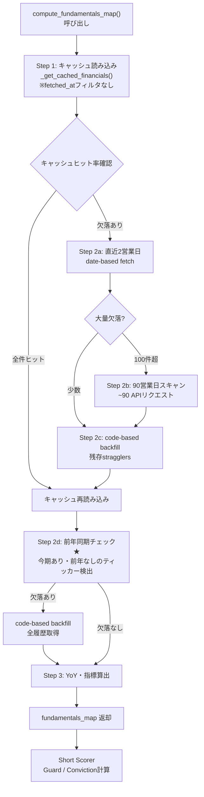

## この記事でわかること

- 「実装した」と「動いている」がなぜ別物なのか、具体的なバグの実例
- J-Quants（金融データAPI）のキャッシュ設計で踏んだ落とし穴
- AIエージェントが日次運用の中で自分のバグに気づくプロセス
- IFRS採用企業でYoY計算が根本的に不可能になるデータ制約

---

## 発端 — AIの記事提案から始まった

3月24日の日次処理。全Phaseが完了し、最後の記事提案ステップでAIエージェントがこう報告した。

> P2 Short Top10に好決算企業が7/10混在した問題は記事ネタになります。「P2 Shortスコアの限界: 好決算企業をなぜShort推奨してしまうのか」として、Zennで書きませんか？

「好決算企業はエントリーしないのが基本になりますか？」と聞き返した。そうだ、売り候補の上位にスクウェア・エニックス・ホールディングス（9684）が入っていた。営業利益+39%の企業が売り候補1位というのは、直感的におかしい。

たしかにスクエニの株価は軟調だ。2026年1-2月にGoogleが汎用3Dワールド生成AI「Project Genie」を発表し、ゲームセクター全体が売り込まれた。Unity -24%、Roblox -13%と業界全体が下げる中、スクエニも巻き込まれている。加えて通期の最終利益を31%減益に下方修正しており、テクニカル的に売り候補に入ること自体には一理ある。

しかし営業利益は前年同期比+39%の増益だ。このシステムには「好業績企業を売り候補から除外するガード」が実装されているはずだった。「スコアの中の計算に既に入ってはいないのですか？」——そう聞いたとき、調査が始まった。

ガードのコードを確認すると、設定値もロジックも正しかった。しかし全銘柄の `op_profit_yoy_pct`（営業利益の前年同期比）が `None` だった。

10銘柄、全部 `None`。

---

## 設計の前提 — Short Guard とは何か

このシステムでは、テクニカルスコアで売り候補になった銘柄に対して「ファンダメンタルズガード」をかける設計になっている。ADR-006（Short 4Dモデル）で設計し、ADR-019（J-Quantsデータ活用拡大）で強化した仕組みだ。

ガードの核心はこうだ。

```python
# app/services/phase2/short_scorer.py L529-533
fin = (financials_map or {}).get(ticker)
if fin:
    # 7a. Strong earnings → dangerous for Short
    op_yoy = fin.get("op_profit_yoy_pct")
    if op_yoy is not None and op_yoy > settings.fundamental_guard_op_profit_yoy_threshold:
        penalty = settings.fundamental_guard_op_profit_penalty
        penalties["fundamental_strong_earnings"] = round(penalty, 4)
        base_score -= penalty
```

`fundamental_guard_op_profit_yoy_threshold` は `10.0`（%）、`fundamental_guard_op_profit_penalty` は `0.5`。

営業利益が前年同期比 +10%超なら、スコアを 0.5 ポイント減算してShort候補から実質除外する。「好業績の企業を空売りするのは危ない」という判断をコードに落とし込んだものだ。

このガードは「実装済み」だった。コードレビューも通っていた。しかし、全銘柄で `op_profit_yoy_pct=None` が返ってくるということは、ガードが一度も発動していなかったことになる。

---

## 調査 — ロジックは正しい、なのになぜ

まず `financials_fetch.py` のキャッシュ取得関数を確認した。当時のコードはこうだった。

```python
# バグのあったコード（修正前）
def _get_cached_financials(
    session: Session, tickers: list[str],
) -> dict[str, list[FinancialStatement]]:
    cutoff = datetime.now(timezone.utc) - timedelta(days=120)
    rows = session.exec(
        select(FinancialStatement).where(
            FinancialStatement.ticker.in_(tickers),
            FinancialStatement.fetched_at >= cutoff,  # ← これが問題
        )
    ).all()
    # ...
```

決算データは四半期ごとに更新されるため、120日（約4ヶ月）でキャッシュを失効させていた。財務データは変わらないのに、取得日時で古いものを切り捨てていた。

`fetched_at >= cutoff` のフィルタは、「120日以内に取得したデータだけを使う」という意味だ。

ここで問題の構造が見えてきた。

前年同期のデータ——たとえば2024年Q3の決算——は開示から1年以上前のことがある。そのデータを最初にDBに格納したのは、もっと前かもしれない。120日の壁を超えていれば、クエリには返ってこない。

YoY計算は「今期のデータ」と「前年同期のデータ」を突き合わせて初めて成立する。前年同期データが `fetched_at >= cutoff` で弾かれれば、`_find_same_quarter_previous_year()` は `None` を返す。結果として `op_profit_yoy_pct=None` になる。

```python
# financials_fetch.py の YoY 計算パス
def _find_same_quarter_previous_year(
    statements: list[FinancialStatement], target: FinancialStatement
) -> FinancialStatement | None:
    """Find the same fiscal quarter from the previous year."""
    try:
        target_year = int(target.fiscal_year)
    except (ValueError, TypeError):
        return None

    prev_year = str(target_year - 1)

    for s in statements:
        if s.fiscal_year == prev_year and s.fiscal_quarter == target.fiscal_quarter:
            return s
    return None
```

渡された `statements` リストに前年データが存在しなければ、ここは必ず `None` を返す。ロジック自体は何も間違っていない。問題はその上流で前年データが捨てられていることだった。

---

## もう一つの落とし穴 — date-range scan の射程

さらに奥に問題があった。

このシステムは初回起動時に「90営業日分の決算開示をスキャンしてDBを構築する」設計になっている。90営業日はおよそ4.5ヶ月で、一つの決算サイクルをカバーする計算だ。

しかし、前年同期データを取得するには約1年前の開示日を参照する必要がある。90営業日のスキャンは、前年同期には届かない。

```python
# date-range scan の射程（90営業日 ≒ 4.5ヶ月）
_DATE_RANGE_SCAN_DAYS = 90  # ~1 quarterly cycle
```

たとえば現在が2026年3月で、最新の決算が2025年Q3（2025年11月開示）だとする。前年同期は2024年Q3（2024年11月開示）だ。これは90営業日どころか、300営業日以上前の話だ。

date-range scan で取れる範囲の外にある。

加えて、code-based backfill（銘柄コード単位で全履歴を取得する仕組み）は「キャッシュに存在しないティッカー」にだけ発動する。今期データは存在するのに前年データが欠落しているケース——まさにこの状況——は `still_missing` の条件を満たさないため、backfillも動かなかった。

三つの問題が重なっていた。

1. `fetched_at >= cutoff` フィルタが前年データを隠していた
2. date-range scan（90営業日）では前年開示に届かない
3. code-based backfill は「存在しないティッカー」にしか発動しない

---

## IFRS の問題 — バグではなくデータの制約

調査を進める中で、もう一つ別の問題が浮上した。

スクエニはIFRS（国際財務報告基準）を採用している。J-Quants の `/fins/summary` エンドポイントでは、IFRS採用企業の `OP`（営業利益）フィールドが空欄になるケースがある。IFRSには日本基準のような「営業利益」という概念が厳密に存在しないため、開示企業によって報告形式が異なるためだ。

つまりスクエニについては、fetched_atフィルタのバグを修正しても、`operating_profit=None` のまま変わらない可能性がある。`_compute_yoy()` は `cur is None` の場合に `None` を返すので、YoY計算が成立しない。

```python
def _compute_yoy(
    current: FinancialStatement, previous: FinancialStatement
) -> float | None:
    """Compute YoY change% for operating profit."""
    cur = current.operating_profit
    prev = previous.operating_profit
    if cur is None or prev is None or prev == 0:
        return None
    return round((cur - prev) / abs(prev) * 100, 2)
```

これはバグではなく、データの制約だ。IFRS企業に対してOPベースのYoY計算を行うには、J-Quantsとは別のデータソース、または企業ごとに異なる利益概念（コアEBITDA等）への対応が必要になる。この課題はIMP-001（J-Quants財務データとP1 Shortの統合改善）の範囲で継続検討中だ。

今回のバグ修正で「ガードが動く企業」は増えた。しかしIFRS企業については引き続きガードが不発のままという制約が残る。これは正直に書いておく必要がある。

---

## 修正 — 2箇所のパッチ

修正は2点。

**パッチ1: fetched_at フィルタの除去**

決算データは開示後に遡及修正されることはない（訂正報告書を除く）。「財務データは不変である」という性質から、`fetched_at` による鮮度管理は不要だと判断した。

```python
# 修正後
def _get_cached_financials(
    session: Session, tickers: list[str],
) -> dict[str, list[FinancialStatement]]:
    """Get cached financial statements grouped by ticker.

    Financial statements are immutable after disclosure, so no fetched_at
    cutoff is applied.  Prior-year data must remain visible for YoY
    computation regardless of when it was fetched.
    """
    if not tickers:
        return {}

    rows = session.exec(
        select(FinancialStatement).where(
            FinancialStatement.ticker.in_(tickers),
        )
    ).all()

    result: dict[str, list[FinancialStatement]] = {}
    for row in rows:
        result.setdefault(row.ticker, []).append(row)

    return result
```

1行の変更で `fetched_at >= cutoff` の制約を除去した。コメントに判断の理由を明記した。

**パッチ2: 前年同期backfillパスの追加（Step 2d）**

キャッシュを再読み込みしたあと、「今期データはあるが前年同期データがない」ティッカーを検出し、コード単位の全履歴取得を走らせる処理を追加した。

```python
# Step 2d: Backfill prior-year data for YoY computation
_quarter_order_bf = {"Q1": 1, "Q2": 2, "Q3": 3, "FY": 4}
tickers_needing_prior: list[str] = []
for tk in tickers:
    stmts = cached.get(tk, [])
    if not stmts:
        continue
    most_recent = max(
        stmts,
        key=lambda s: (s.fiscal_year, _quarter_order_bf.get(s.fiscal_quarter, 0)),
    )
    if _find_same_quarter_previous_year(stmts, most_recent) is None:
        tickers_needing_prior.append(tk)

if tickers_needing_prior:
    logger.info(
        "Prior-year backfill: %d tickers missing YoY data",
        len(tickers_needing_prior),
    )
    backfill_count = 0
    for tk in tickers_needing_prior:
        try:
            records = _fetch_summaries_by_code(tk)
            for record in records:
                _upsert_financial_statement(session, tk, record)
                backfill_count += 1
        except Exception as e:
            logger.warning("Prior-year backfill failed for %s: %s", tk, e)
    if backfill_count > 0:
        session.commit()
        backfill_cached = _get_cached_financials(session, tickers_needing_prior)
        cached.update(backfill_cached)
```

ポイントは「全ティッカーにbackfillを走らせない」設計だ。前年同期が欠落しているティッカーだけを対象にする。売り候補は多くても数十銘柄なので、APIのレート制限（60 req/min）の観点でも許容できる。

---

## データフロー全体像

修正後のデータ取得フローをMermaid図で整理する。



★が今回追加したStep 2dだ。既存の3ステップに「前年同期データの確保」を追加することで、YoY計算の前提条件を整えた。

---

## 検証 — Guard が初めて動いた

修正後、修正コミット `225c029` を適用してスコアを再計算した。

| 銘柄 | op_profit_yoy_pct | Guard発動 | 備考 |
|------|-------------------|-----------|------|
| スクウェア・エニックス（9684） | +38.96% | ✓ ペナルティ0.5適用 | 短期売りには危険と判定 |
| セガサミーホールディングス（6460） | -54.6% | 非発動 | Conviction加点方向 + 連続7四半期減益 |
| UACJ（5741） | +3.82% | 非発動 | 閾値+10%未満のため |

スクエニがShort候補の上位から除外された。Guard が正しく機能している。

セガサミーは逆に、-54.6% という深刻な利益減少が Conviction（確信度）の加点要素として機能する。このシステムでは「好業績企業を売らない」だけでなく「業績悪化企業への売りの確信を高める」という2方向にファンダメンタルズを使っている。

ただし前述の通り、IFRS採用企業については `operating_profit` フィールドがNullのままなので、Guard・Convictionともに不発のケースが残る。これは今後の改善課題だ。

---

## 「実装した」と「動いている」の違い

ソフトウェア開発で「実装済み」と言うとき、一般的には次の状態を指す。

- コードが書かれてリポジトリにマージされている
- ユニットテストが通っている
- コードレビューを経ている

一方「動いている」とは、本番環境で実際のデータに対して期待通りの結果を出し続けている状態だ。この二つの間には、しばしばギャップがある。

今回のバグはまさにその典型だった。コードは存在し、テストも通り、レビューも済んでいた。しかし本番環境では一度もガードが発動していなかった。

なぜユニットテストで検出できなかったのか。

- テストはモックデータを使う。「前年データが揃った状態」を前提に書く
- `fetched_at` フィルタの問題は、データが120日以上前に取得されて初めて現れる
- date-range scan の射程問題は、本番運用でDBが「今期データのみ」の状態になって初めて顕在化する

いずれも「時間の経過」と「本番データの偏り」が条件だ。テスト環境では前年データと今期データを両方モックに入れるので、前年データが見えなくなる状況が再現されない。開発時点では正しく動いていたものが、運用開始から数ヶ月経って壊れるというパターンだった。

## なぜ気づいたか — 記事提案が検出器になった

このバグに気づいたきっかけは、日次処理の最後にAIエージェントが出した記事提案だった。「P2 Short Top10に好決算企業が7/10混在」という分析結果を見て、「好決算企業はエントリーしないのが基本か？」「スコアの計算に既に入っていないのか？」と質問したことで調査が始まった。

自動スコアリングの結果を単純にパスするのではなく、「この結果は妥当か」を一段引いて確認するステップが、バグの早期発見につながった。これはADR-004（人間承認の境界線）で「AIが推奨し、人間が承認する」設計にしている理由の一つでもある。

---

## ADR-019 の本題 — J-Quants データ活用拡大

今回のデバッグは副産物で、ADR-019 の本題は J-Quants のデータ活用を拡大することだ。

J-Quants Light プランを契約しているが、使っていたのは3エンドポイント・10フィールド程度に過ぎなかった。`fins/summary` には未使用の有用なフィールドが多数あった。

ADR-019 で定義した2軸での拡大はこうだ。

**軸1: スコアリングへの統合（自動・定量）**

| 指標 | 算出方法 | 売りスコアへの用途 |
|------|---------|----------------|
| 進捗率 | 累計売上 / 通期予想売上 | 予想に対して遅れている銘柄を検出 |
| Forward PER | 株価 / 予想EPS | 割安銘柄の空売りを防ぐ |
| ROE | 純利益 / 自己資本 × 年率換算 | 資本効率の低い銘柄を弱気と評価 |
| 利益の質 | 営業CF / 純利益 | CF裏付けのない利益を検出 |

これらは `enriched_indicators` に追加され、Short Scorer の Guard と Conviction の両方に使われる。

```python
# compute_fundamentals_map() の返却値（修正後）
result[ticker] = {
    "op_profit_yoy_pct": op_profit_yoy,       # YoY（修正で正しく算出）
    "consecutive_decline_quarters": consecutive,
    "per": per,
    "pbr": pbr,
    "dividend_yield": div_yield,
    # ADR-019 新規指標
    "forward_per": forward_per,
    "progress_rate": progress_rate,
    "progress_deviation": progress_deviation,  # 進捗の期待値との乖離
    "roe": roe,
    "profit_quality": profit_quality,           # CFO/NP
    "payout_ratio": payout_ratio,
    "next_year_op_growth": next_year_op_growth,
}
```

**軸2: マネージャー判断への提供（参照・定性）**

投資家別売買動向（海外投資家・個人・信託銀行の差引）や翌期ガイダンス、自社株買いデータはスコアには組み込まず、AIエージェントのマネージャー判断の参考情報として提供する。定量化が難しい情報ほど、定性判断の補助に使う設計だ。

---

## 実験の現状と残課題

このシステムは「AIエージェントで株式スイングトレードを仕組み化する実験」だ。成功しているかどうかは、まだわからない。成績はトントンから微プラスの範囲で推移しており、仕組みが「機能している」という確信はまだ持てていない。

今回のバグ修正で、少なくとも「ガードが動いていなかった」という問題は解消された。ファンダメンタルズガードが正常に発動するようになったことで、好業績企業の誤売りが減ることを期待している。ただし「期待」であって「確信」ではない。

残課題は二つある。

一つ目はIFRS企業への対応。J-Quants の `OP` フィールドがNullになるIFRS採用企業については、今回の修正後も `op_profit_yoy_pct=None` のままだ。IFRS企業に対してはOPベースのYoY計算ができないため、代替指標（NP基準のYoYや、利益の質スコア単独での評価）を検討する必要がある。

二つ目はP1 Short（Phase 1の売りスコア）のファンダメンタルズ未統合。今回の修正はPhase 2のスコアラーに効いているが、Phase 1については price-based のみのままだ（IMP-001として積み残し中）。

仕組みを作りながら運用し、バグを見つけ、改善する——この繰り返しが実験の実態だ。

---

## まとめ

- **「実装済み」は「動いている」ではない** — コードがあり、テストが通り、レビューを経ていても、本番で正しく動いているとは限らない。`fetched_at >= cutoff` フィルタは時間の経過で初めて問題を起こした
- **日次運用の中での気づきがバグの検出器になる** — ユニットテストでは再現できないタイムスタンプ依存のバグを、AIの記事提案に対する人間の「なぜ？」から発見した
- **データの制約はバグではない** — IFRS企業で `OP=None` になるのはJ-Quantsの仕様。バグと制約を混同しないことが重要
- **前年同期backfillの追加** — 「今期データあり・前年データなし」という中間状態を明示的に検出し、必要な銘柄だけにcode-based全履歴取得を走らせる設計にした

コード変更は1ファイル（`app/services/financials_fetch.py`）、+52行/-15行。規模は小さいが、Guard が一度も発動していなかったという影響は大きかった。

---

:::message
本記事はシステム開発の実験記録です。特定の銘柄の売買を推奨するものではありません。投資判断はご自身の責任でお願いします。
:::
