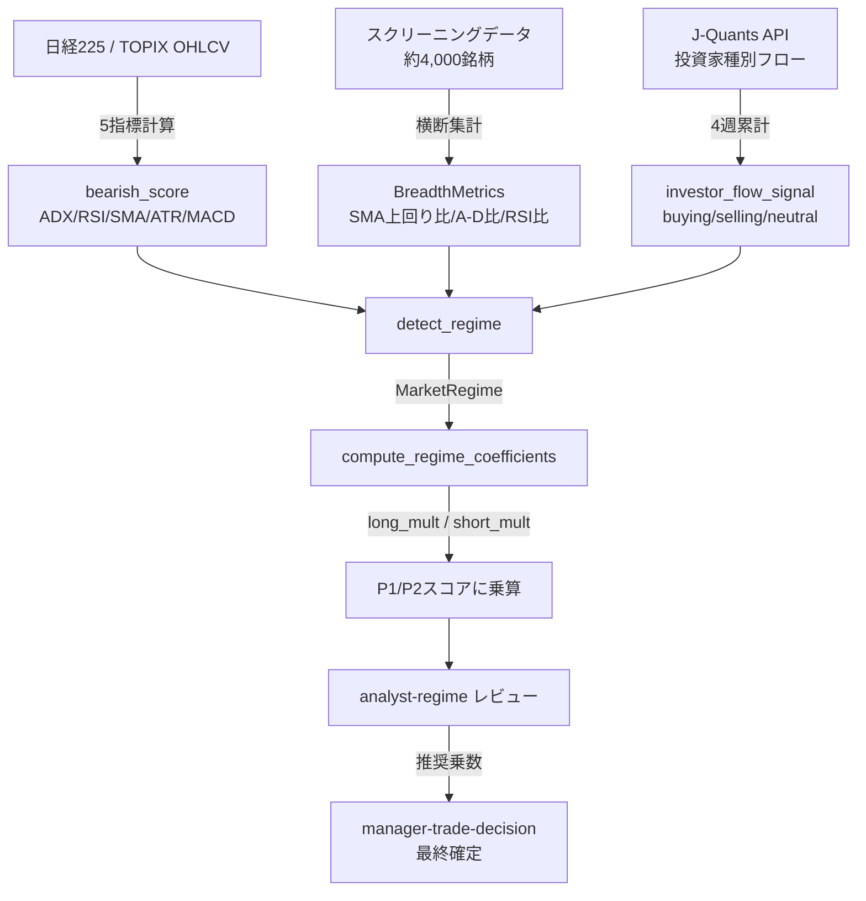
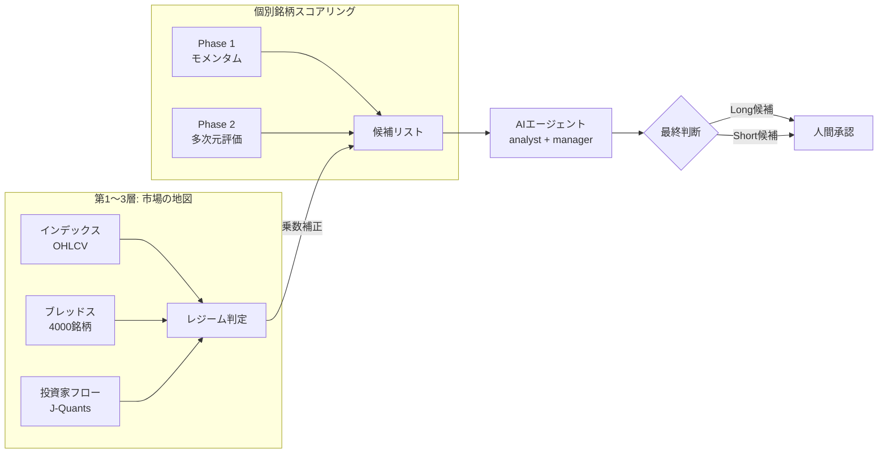

> Claude Codeで日本株スイングトレードの自動分析システムを作っています。毎日約4,000銘柄をスコアリングし、AIエージェントが売買候補を推奨→人間が承認するパイプラインです。本記事ではそのパイプラインに「市場全体の環境判定（レジーム）」を組み込んだ設計を解説します。[シリーズ一覧はこちら](https://zenn.dev/taiki_kishi)

## この記事でわかること

- 日本株スクリーニングデータ（約4,000銘柄）を使って市場レジーム（相場環境）を判定する仕組み
- インデックスOHLCV・市場全体のブレッドス（breadth: 相場の広がり）・投資家フローの3層構造
- 算出した環境スコアをAIエージェントのスコアリングパイプラインに組み込む方法
- 3月23日にLong 3銘柄が同日全滅した事件と、そこから生まれた監査証跡の設計

---

## 「なんでbearなのに3銘柄もLongが選ばれたんだ」

2026年3月23日、日次処理の結果を確認していたら、その日の夜に3銘柄のロスカット通知が重なった。

| 銘柄 | 方向 | エントリー | ロスカット | 損益 |
|------|------|-----------|-----------|------|
| ファーマフーズ（2929） | Long（現物買い） | 703円 | 637円 | -9.39% |
| フジクラ（5803） | Long | 25,290円 | 23,970円 | -5.22% |
| ナ・デックス（7435） | Long | 1,120円 | 1,087.5円 | -2.90% |

その日のレジーム判定は **bear（確信度69%）** だった。

「売り環境と判断しているのに、なぜ買いが3つも採用されているのか」

---

これが今回のテーマです。レジーム（市場の相場環境）を判定し、その結果をスコアリングパイプラインに反映させる仕組みを作っているのですが、3月23日の結果を見る限り、機能していなかった疑いがあります。

現時点では「なぜ整合しなかったか」の原因が特定できていません。本記事は完成した仕組みの解説ではなく、「こういう設計で実験しているが、まだ答えは出ていない」という記録です。

## レジーム判定とは

株式投資における**レジーム**とは、「市場全体が今どういう環境にあるか」を分類した概念です。

このシステムでは4つのラベルを使っています:

- **bull**: 上昇トレンド（個別株のLong=現物買いが有利）
- **bear**: 下降トレンド（Short=信用売りが有利、Longはリスク高）
- **neutral**: トレンドなし（方向感が乏しい）
- **volatile**: ボラティリティ（価格変動）が大きく、方向が定まらない

なぜレジームを判定するかというと、**個別銘柄のスコアがいくら高くても、市場全体が崩れている環境でLong（買い）に入ると、波に逆らって泳ぐことになる**からです。

この判定ロジックは `app/services/market_regime.py` に実装されており、3層の情報源から合成されます。

## 第1層: インデックスから5つの指標を合成する

最初のデータソースは日経225やTOPIXの日足OHLCV（始値・高値・安値・終値・出来高）です。ここから5つのテクニカル指標を計算し、「どれだけベアリッシュ（弱気）か」を0〜1のスコアに変換します。

```python
# bearish_score の合成（market_regime.py より抜粋）
bearish_score = (
    0.20 * trend_score      # ADX: トレンドの強さ
  + 0.25 * rsi_score        # RSI: 過熱・冷え込み
  + 0.25 * sma_slope_score  # SMA25: 25日移動平均の傾き
  + 0.10 * volatility_score # ATR: ボラティリティの拡大
  + 0.20 * macd_score       # MACD: 運動量の方向
)
```

各次元の変換ロジックを例示します:

```python
# RSIスコア: RSI < 40 → ベアリッシュ（高スコア）、> 60 → ブリッシュ（低スコア）
if rsi < 40:
    rsi_score = min((60 - rsi) / 30, 1.0)
elif rsi > 60:
    rsi_score = max(0.0, (60 - rsi) / 30 + 0.5)
else:
    rsi_score = 0.5  # 40-60はニュートラル

# SMA25の傾き: 5日間の変化率（%）
sma25 = close.rolling(25).mean()
vals = sma25.dropna().iloc[-5:]
sma25_slope = (vals.iloc[-1] / vals.iloc[0] - 1) * 100
# 傾きが負かつ急 → ベアリッシュ側に変換
```

最終的に `bearish_score > 0.6 かつ ADX（トレンド強度指標）が閾値超え` でbear判定します。

**注意点**: ADX（Average Directional Index: トレンドの方向性を問わない強度指標）を判定条件に含めているのは、「弱いトレンドなのにbear判定する」ことを防ぐためです。bearish_scoreが高くても相場がレンジ（横ばい）なら、volatileラベルを選ぶ判断になります。

## 第2層: ブレッドス — 4,000銘柄の体温計

インデックスの値動きだけでは「表面の温度」しかわかりません。「体の中から何が起きているか」を見るために、毎日スクリーニングしている約4,000銘柄の横断データをブレッドス（breadth: 相場の広がり）として集計します。

```python
@dataclass
class BreadthMetrics:
    """約4,000銘柄の横断統計"""
    pct_above_sma25: float        # SMA25（25日移動平均）を上回る銘柄の割合
    median_return_20d: float      # 20日リターンの中央値（%）
    pct_rsi_above_50: float       # RSI50超えの銘柄の割合
    advance_decline_ratio: float  # 前日比プラスの銘柄の割合（A/D比）
    sample_size: int
```

`compute_breadth_metrics()` はスクリーニングデータの `feature_map`（銘柄コード → 指標辞書）を受け取り、この4指標を集計します:

```python
def compute_breadth_metrics(feature_map: dict[str, dict]) -> BreadthMetrics | None:
    sma_devs, returns_20d, rsi_vals, returns_1d = [], [], [], []

    for feats in feature_map.values():
        if (v := feats.get("sma_dev_25d")) is not None:
            sma_devs.append(float(v))
        if (v := feats.get("return_20d")) is not None:
            returns_20d.append(float(v))
        # ... rsi_14, return_1d も同様に収集

    return BreadthMetrics(
        pct_above_sma25=sum(1 for x in sma_devs if x > 0) / len(sma_devs),
        advance_decline_ratio=sum(1 for x in returns_1d if x > 0) / len(returns_1d),
        # ...
    )
```

3月23日のブレッドスデータを見ると:

- `pct_above_sma25`: 11.5%（4,000銘柄のうち88.5%がSMA25を下回っていた）
- `pct_rsi_above_50`: 9.8%（RSI50超えはわずか10%）
- `advance_decline_ratio`: 0.07（当日プラスだった銘柄は7%のみ）

A/D比が0.07というのは、「100銘柄のうち7銘柄しかその日値上がりしなかった」状態です。この数値は異常値と言っていいレベルです。

### トランジション検出

ブレッドスの用途はもう一つあります。インデックスの方向と乖離しているとき、「転換点の手前にいる可能性」を検出します:

```python
def _detect_transition(label: str, breadth: BreadthMetrics | None):
    # narrowing: bullなのにブレッドスが弱い → 天井圏の兆候
    if label == "bull" and breadth.pct_above_sma25 < narrowing_threshold:
        strength = (narrowing_threshold - breadth.pct_above_sma25) / narrowing_threshold
        return "narrowing", strength

    # broadening: bearなのにブレッドスが強い → 底打ちの兆候
    if label == "bear" and breadth.pct_above_sma25 > broadening_threshold:
        strength = (breadth.pct_above_sma25 - broadening_threshold) / (1.0 - broadening_threshold)
        return "broadening", strength
```

broadening検出が実際にbottomを捉えられるかは、まだデータが十分ではなく検証中です。

## 第3層: 投資家フロー — 誰が買い、誰が売っているか

3層目は東証が公表している投資家種別ごとの売買動向です。J-Quants API（日本取引所グループが提供するデータAPI）を通じて取得します。

```python
def fetch_investor_types(
    session,
    weeks: int = 4,
    section: str = "TSEPrime"  # 東証プライム市場
) -> dict | None:
    """
    エンドポイント: GET /v2/equities/investor-types
    返却: 機関投資家、外国人投資家、個人投資家などの週次売買金額
    """
    # 直近4週分を集計
    recent = sorted(data, key=lambda x: x["PublishedDate"], reverse=True)[:weeks]
    net_4w = sum(row.get("ForeignersNet", 0) for row in recent)

    # 3週連続で同方向 → フロー確認
    nets = [row.get("ForeignersNet", 0) for row in recent[:3]]
    if all(n > 0 for n in nets):
        trend = "buying"
    elif all(n < 0 for n in nets):
        trend = "selling"
    else:
        trend = "neutral"
```

外国人投資家のフローを重視しているのは、日本株市場では外国人が売買代金の過半を占めており、フロー方向がレジームの持続性に影響すると考えているためです。ただしこれも仮説段階で、実際に有効かはこれから検証します。

## 係数算出: スコアへの反映

3層で集めた情報をどうスコアリングに反映するか。`regime_adjustment.py` が、レジームから Long/Short それぞれの**乗数（multiplier）**を計算します。

```python
def compute_regime_coefficients(regime: MarketRegime) -> RegimeCoefficients:
    # ① bearish_score → 基本偏差（0.5を中心に±の振れ）
    raw_delta = (0.5 - regime.bearish_score) * 0.6

    # ② 確信度で減衰（確信度が低いほど中立に近づく）
    delta = raw_delta * regime.regime_confidence

    # ③ Long/Short乗数を算出
    long_mult = 1.0 + delta   # bearの場合 delta < 0 → Long乗数が下がる
    short_mult = 1.0 - delta  # bearの場合 delta < 0 → Short乗数が上がる

    # ④ トランジション補正（narrowing → Longをさらに下げる等）
    if regime.transition_signal == "narrowing":
        long_mult -= regime.transition_strength * 0.1

    # ⑤ クランプ（上下限の範囲内に収める）
    long_mult = max(long_min, min(long_max, long_mult))
    short_mult = max(short_min, min(short_max, short_mult))
```

3月23日の bear（確信度69%）では:

```
raw_delta = (0.5 - 0.694) * 0.6 ≒ -0.116
delta     = -0.116 * 0.69 ≒ -0.080
long_mult ≒ 1.0 - 0.080 = 0.92
short_mult ≒ 1.0 + 0.080 = 1.08
```

「スコアを0.92倍にする」という補正を加えた上でも、P1/P2スコアが高い銘柄はLong候補として浮上してしまいます。これが後述するH2の仮説につながります。

パイプライン全体をMermaid図で示します:



## AIエージェントが数式を上書きする

乗数の計算は「今日のスナップショット」に過ぎません。数式が苦手なのは文脈の読み取りです。「昨日から何が変わったか」「1日の反発は本物か、ただのリバウンド（短期的な反発）か」という判断は、数式より言語モデルのほうが得意です。

そこで `analyst-regime`（Claude Sonnet）というエージェントが `compute_regime_coefficients()` の出力をレビューします。入力はこのような構造です:

- `bearish_score` と各次元スコアの実数値
- 昨日との比較（RSI、SMA傾き等の変化量）
- ブレッドスの4指標（現在値と前日差）
- 投資家フロー（4週累計と直近トレンド）
- 計算式が出したベースライン乗数

3月25日の例では、RSI50超え比率が18.7%から50.2%に急回復しました。この1日の急変に対して、エージェントは「1日の反発でトレンド転換と判断するのは早計。フローの継続性を確認するまでbear維持」という方向でレビューしました。

最終的な乗数確定は `manager-trade-decision`（Claude Opus）が行い、そのセッションではレジーム情報を参照しながら新規エントリー数の上限や、LongとShortの比率を調整します。

## 実データで見る: 3/16〜3/25のレジーム推移

実際のパイプラインが出力したレジームの時系列です:

| 日付 | レジーム | 確信度 | SMA25上回り | RSI50超え | A/D比 | L乗数 | S乗数 |
|------|---------|--------|-----------|---------|-------|-------|-------|
| 3/16 | bear | 61% | 24.9% | 25.9% | 0.38 | 0.94 | 1.06 |
| 3/17 | bear | 60% | 25.3% | 23.6% | 0.53 | 0.95 | 1.05 |
| 3/18 | bear | 61% | 36.5% | 26.3% | 0.82 | 0.94 | 1.06 |
| 3/19 | bear | 65% | 20.6% | 13.7% | 0.09 | 0.93 | 1.07 |
| 3/23 | bear | 69% | 11.5% | 9.8% | **0.07** | 0.92 | 1.08 |
| 3/24 | bear | 62% | 16.1% | 18.7% | 0.81 | 0.94 | 1.06 |
| 3/25 | bear | 64% | 26.3% | 50.2% | 0.87 | 0.94 | 1.06 |

3/23のA/D比0.07は際立っています。その前後の3/18（0.82）や3/24（0.81）と比べると、3/23だけが極端な全面安だったことがわかります。

Long乗数は0.92と補正されていますが、3/16から一貫してbearが続いているにもかかわらず Long が採用され続けていたことになります。「0.92倍の補正では不十分だった」のか、それとも「係数の問題ではなく別の原因がある」のか、まだわかっていません。

## まだわからないこと: 4つの仮説

3月23日の全滅を受けて、設計判断記録（ADR-026）を起票しました。現在のstatusは `proposed` で、決定ではなく「問いを立てた」段階です。

仮説は4つあります:

**H1: タイミングのギャップ** — レジームはT-1（前日終値）のデータで計算し、翌日の注文に使います。当日の朝に市場環境が急変した場合、前日のレジームは役に立ちません。

**H2: 係数が弱すぎる** — bear環境でlong_mult=0.92にしても、個別スコアが高い銘柄はLong候補として残ります。もっと強い抑制が必要だったかもしれません。

**H3: 銘柄選定基準がレジームと整合していない** — スコアリングは個別銘柄の強さを測りますが、「市場全体が崩れているとき」の判断基準が入っていない可能性があります。

**H4: ストップロス設定がレジームに対して不適切** — bear環境では値幅が大きく動くので、通常より広いSL幅が必要だったかもしれません。

現状は「どれが正解かわからない」ため、まず**監査証跡**を整備します:

```python
# ScoreRun テーブルに追加するカラム（検討中）
# regime_label       : "bear"
# regime_confidence  : 0.69
# regime_coefficients: {"long_mult": 0.92, "short_mult": 1.08}

# PortfolioPosition テーブルに追加するカラム
# regime_at_entry    : "bear"
# regime_aligned     : False  # bearなのにLongを選んだ → 不整合
```

`regime_aligned` フラグを記録しておくことで、週次レビューで「レジームと整合したポジションの勝率 vs 不整合ポジションの勝率」を比較できます。4週分以上データが溜まった段階で、H1〜H4のどれが支配的かをデータで判断する計画です。

## まとめ

レジームは「方向性の地図」であり、個別銘柄スコアは「道案内」です。地図がbearを指しているのに、道案内がLongに連れていくとすれば、どちらかに問題があります。



3/23の全滅は「地図と道案内がうまく連動していない」可能性を示しています。正しい設計かはまだわかりません。

ただ、「正しいかわからないので改善できない」という状態から抜け出すために、まず計測する。それだけです。

---

### 補足: ブレッドスを使う設計判断

インデックスOHLCVだけでレジームを判定するアプローチもありますが、約4,000銘柄のデータが毎日手元にある環境では、それを使わない手はないと考えました。

インデックスは「代表銘柄の平均」なので、「一部のセクターだけが崩れ始めている」「中小型株はすでに下落しているが大型株が指数を支えている」といった状況を読めません。ブレッドス指標はこの「中身の格差」を可視化します。

ただし、この情報がどれだけ有効かも、現時点では検証中です。broadening（底打ち）検出の精度については特に懐疑的で、「底が入った」と判断するには複数日の確認が必要だと感じています。

---

※本記事は筆者の実験記録であり、投資助言ではありません。投資判断はご自身の責任でお願いします。
