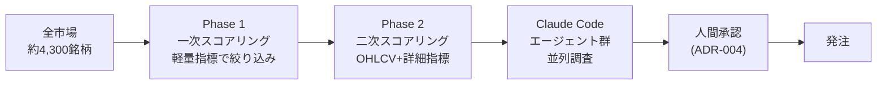
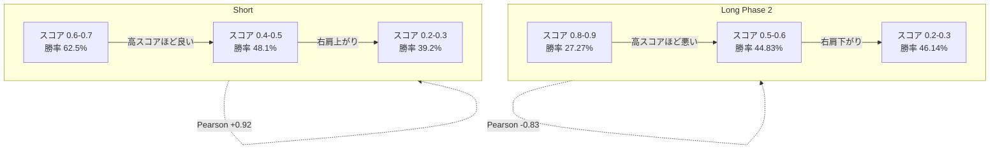
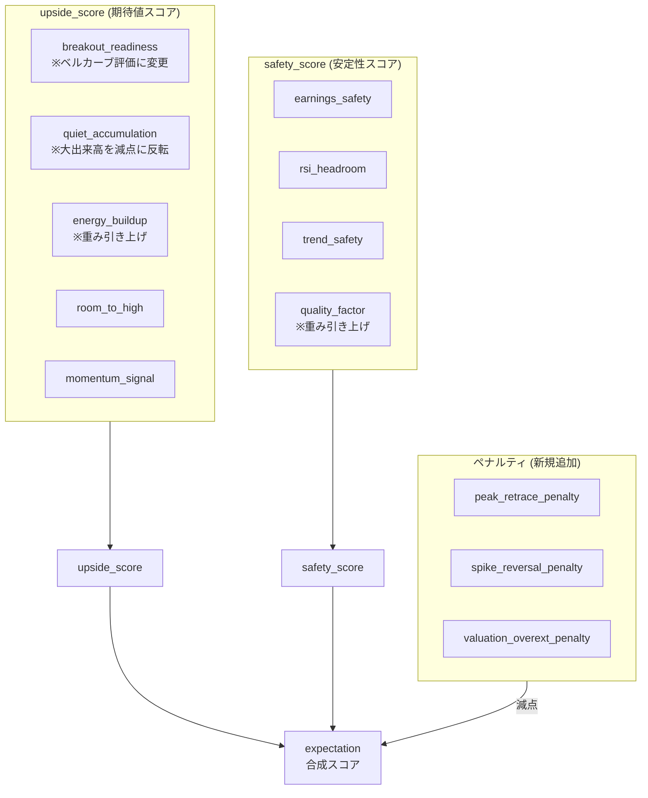

## この記事でわかること

- AIスコアリングシステムが「高スコアほど負ける」逆相関になっていた実例と、その発見プロセス
- Pearson相関係数 **-0.83** という数字が示した根本的な設計バグの解剖
- 「単一指標フィルタ」ではなく「連続値ペナルティ」で解決するアーキテクチャ的理由
- Short (売り建て) が同期間に Pearson +0.92 で機能していた非対称性の示唆
- 振り返りDB基盤がなければ永遠に見えなかった問題 — 自己改善ループの設計

---

> 本記事は「JPSS (Japan Stock Swing Signals)」という自作AIシステムの設計判断記録（ADR-032）に基づいています。JPSSは日本株約4,300銘柄を毎日スコアリングし、Claude Codeの16エージェントが推奨→人間承認→振り返り→改善のOODAループを回す実験的システムです。実験の途中であり、投資成績の保証はありません。

---

## 導入: 「気のせいじゃないな、これ」

「また負けた」

2026年3月から4月にかけて、Long (買い建て) のエントリーが立て続けに損切りになった。3勝10敗。PnL -221,100円。

それだけなら「相場が悪かった」で片づけられる。だが、負けたトレードのほぼ全てで共通のパターンがあった。**システムが「最高スコア」と評価した銘柄ほど、大きく負けていた。**

フジクラ（5803）のエントリーを振り返ると、システムが付けたスコアは最上位ランク。25,290円で買って、そのまま天井だった。損失 -132,000円。

INPEX（1605）も同じだった。RS（相対強度スコア）= 0.951、期待値スコアは 0.794。システムが最高評価を付けた。結果 -55,700円。

負けた銘柄のチャートを一枚ずつ並べ直すと、更にもう一つの共通点が見えてきた。**いずれも、数日前に急騰した後、高値から下がり始めているタイミング**でエントリーしていた。エントリー時点では「勢いのある銘柄」に見えていたが、日足チャートに引いて見ると、明らかに「ピークを過ぎた銘柄」だった。

そしてこのシステムを設計したとき、自分が意図していたのは真逆のことだった。**「上がる前の、あるいは上がり始めの銘柄を掴む」**。ピークで買うのではなく、動き出すタイミングを捉える。これが出発点のビジョンだったはずだ。実装結果はビジョンから離れていた。

「気がするだけかもしれない」と最初は思った。しかし感覚で判断してはいけない。だからこのシステムには最初から「振り返りDB」を組み込んでいた。過去のスコアとその後の値動きを蓄積するテーブルが稼働していた。

そのデータを引いた。

結果、見たくなかった数字が出てきた。

---

## セクション1: JPSS とそのスコアリング構造

まず簡単にシステムの概要を説明します。

**JPSS** は、日本株の全市場（約4,300銘柄）を毎日スコアリングし、Claude Codeで実装した16のエージェントが分析→推奨→人間承認→振り返り→改善のサイクルを回すシステムです。

スコアリングは2段階で構成されています。



- **Phase 1 (一次スコアリング)**: 全4,300銘柄を軽量指標（相対強度・出来高蓄積・ボラティリティ）で高速にスコアリングし、上位候補を絞り込みます
- **Phase 2 (二次スコアリング)**: Phase 1 の上位銘柄をOHLCVデータと詳細指標で精査します。Long の場合、upside_score (期待値スコア) と safety_score (安定性スコア) の2軸で評価し、expectation (合成スコア) を算出します
- **人間承認**: Phase D で最終承認。AI推奨をそのまま執行しない

Long と Short (売り建て) は独立したスコアリング系統を持ちます。Short は下落トレンド確立後に bounce_failing パターン（SMA25での反発失敗）を待ち伏せる4次元モデルで動いています。

---

## セクション2: 「気がする」を数字に変える — 振り返りDB基盤

なぜデータで検証できたのか。それは最初から「自己改善ループ」を設計に組み込んでいたからです。

ADR-007 の「ブラックボックス化禁止」原則に従い、スコアリング結果を永続化する構造になっています。

```python
# スコア実行時に全指標をJSONBで保存
class P2ScoreRun:
    scorer_version: str          # "long_v2_short_v1" でバージョン追跡
    score_date: date
    symbols_scored: int
    results: list[P2ScoreResult]  # 全銘柄のスコアを保持

class P2ScoreResult:
    symbol: str
    expectation: float           # 合成スコア (0.0-1.0)
    upside_score: float          # 期待値スコア
    safety_score: float          # 安定性スコア
    indicators: dict             # 全サブ指標をJSONBで記録
    score_date: date
```

エントリー時には `entry_snapshot` として、その時点のスコア・market regime・全指標の値をスナップショットとして保存します。クローズ後は `post_close_tracking` が14日間の株価追跡を行い、forward return を計算します。

```python
# forward return の計算（概略）
def compute_forward_returns(
    score_results: list[P2ScoreResult],
    ohlcv: dict[str, list[DailyOHLCV]],
    horizon_days: int = 5,
) -> list[ForwardReturnRecord]:
    records = []
    for result in score_results:
        future_prices = ohlcv.get(result.symbol, [])
        if len(future_prices) >= horizon_days:
            fwd_return = (
                future_prices[horizon_days - 1].close / future_prices[0].open
            ) - 1.0
            records.append(ForwardReturnRecord(
                symbol=result.symbol,
                score=result.expectation,
                forward_return_5d=fwd_return,
                score_date=result.score_date,
            ))
    return records
```

この基盤があったからこそ、「スコアと5日後リターン」の相関を定量的に測定できました。

---

## セクション3: 衝撃の数字 — Pearson -0.83

測定期間: 2026-02-01 〜 2026-04-15、forward 5日間 return

### Long Phase 2 (二次スコアリング)

| 指標 | 値 |
|------|----|
| 観測数 | 約83,000件 |
| 日次 rank IC 平均 | -0.039 |
| **Pearson相関 (スコア帯中心値 vs 勝率)** | **-0.8287** |

スコア帯別の勝率を並べると、これが見えます。

| スコア帯 | n | 勝率 | 平均 return |
|---------|---|------|------------|
| 0.8-0.9 | 11 | **27.27%** | **-1.949%** |
| 0.7-0.8 | 880 | 41.70% | -0.893% |
| 0.6-0.7 | 9,801 | 43.72% | -0.506% |
| 0.5-0.6 | 29,447 | 44.83% | -0.289% |
| 0.4-0.5 | 29,278 | 45.32% | -0.162% |
| 0.3-0.4 | 11,028 | 45.69% | -0.078% |
| 0.2-0.3 | 2,137 | 46.14% | **+0.105%** |

右端の数字が示すことはシンプルです。**スコアが高いほど勝率が下がっています。** スコア最上位帯（0.8-0.9）の勝率は27%。コインを投げたほうがマシな数字です。

```python
# 実際の検証コード（概略）
import numpy as np
from scipy import stats

score_band_centers = [0.25, 0.35, 0.45, 0.55, 0.65, 0.75, 0.85]
win_rates = [0.4614, 0.4569, 0.4532, 0.4483, 0.4372, 0.4170, 0.2727]

pearson_r, p_value = stats.pearsonr(score_band_centers, win_rates)
# pearson_r = -0.8287
# p_value = 0.021  ← 統計的有意
```

### Short (売り建て) — 対照的な結果

同期間の Short スコアリングを同じ手法で検証すると、全く逆の結果が出ました。

| 指標 | 値 |
|------|----|
| 観測数 | 約24,000件 |
| **Pearson相関** | **+0.9211** |
| Top5/day 勝率 | 62.5% |
| スコア帯 0.6-0.7 勝率 | 62.5% |

Short は完全に機能していました。スコアが高いほど勝率が上がる、本来あるべき正の相関です。



この非対称性が、次の問いを生みました。**なぜ同じエンジニアが同時期に設計したのに、Long は逆相関でShort は正相関なのか？**

---

## セクション4: 根本原因の解剖 — 「動いた後」を高評価していた

### Phase 2 Long のスコア構造

Phase 2 Long では、expectation (合成スコア) は以下の2軸から計算されます。

- **upside_score (期待値スコア)**: 上値余地・相対強度・出来高蓄積・エネルギー蓄積など
- **safety_score (安定性スコア)**: 収益安全性・RSIヘッドルーム・トレンド安定性など

問題は upside_score の中にありました。全13エントリーを勝ち/負けに分けて各サブ指標の平均を比較すると、構造的なパターンが浮かびます。

| サブ指標 | 勝ちトレード平均 | 負けトレード平均 | 示唆 |
|---------|---------------|---------------|------|
| `relative_strength` | 0.868 | 0.878 | **選別機能なし**。全銘柄が既に上位87%に動いた後 |
| `volume_confirm` | 0.622 | 0.802 | **逆指標**。出来高増 = 注目集中済み = 動いた後 |
| `energy_buildup` | 0.833 | 0.715 | **唯一有効**。BBスクイーズが勝ちトレードで高い |
| `bb_width` | 0.136 | 0.202 | ボラ収縮中の方が勝率が高い |

`relative_strength` の差は 0.010 しかありません。勝ちトレードと負けトレードをほぼ区別できていない。`volume_confirm` に至っては完全な逆指標で、負けトレードの方が0.18も高い。

**根本原因は設計思想にありました。**

upside_score の主要構成要素（`relative_strength`、`volume_confirm` の一部）は「既に株価が動いた後の状態」を高評価する設計だったのです。「セクター内で相対的に強い = すでに上昇済み」「出来高が多い = 市場の注目が集まり切った」。これを高く評価するということは、買い時のピークを高スコアにしていたことと同義です。

唯一有効だったのは `energy_buildup` でした。ボリンジャーバンドのスクイーズ（BB width の収縮）を検出するこの指標だけが、「これから動く」状態を捉えていました。

### 設計意図と実装の乖離

ここで注意したいのは、この「動いた後」を高評価する構造が、**意図して作られたわけではない**ことです。設計時のビジョンは「動き出す前、または動き出し始めを掴む」でした。ところが指標を組み合わせてスコア化していく過程で、`relative_strength` × `volume_confirm` のような「既に動いた強い銘柄を高評価する」成分が優位になっていきました。

コードレビューだけでは気付けませんでした。個々のサブ指標は設計時には妥当に見える（相対強度が強い銘柄を評価する、出来高が厚い銘柄を評価する）。しかし**forward return と突き合わせて初めて**、これらが複合で「ピーク検出器」として機能していたことが浮かびます。

単体で意味があっても、組み合わせると意図と逆方向に働く ─ スコアリング設計の典型的な罠でした。

### Short との非対称性

Short が機能していた理由はシンプルです。Short の bounce_failing パターンは「下落トレンドが確立された後、バウンス失敗の瞬間を待ち伏せる」設計です。**「動いた後の状態」ではなく「次の動きのタイミング」を評価している。** この違いが Pearson +0.92 と -0.83 の差を生みました。

---

## セクション5: ADR-032 v2 の設計改善

問題が特定できたので、修正の方向性は明確でした。**「動き出した後」ではなく「動き出す前」を評価するスコアに転換する。**

正確には、これは「新しい発想」ではなく **当初の設計意図への回帰** でした。「動き出す前を掴む」という最初のビジョンを、スコアリング構造にきちんと反映し直す作業です。v1 では指標の組み合わせが意図と逆方向に働いていた。v2 は意図していた場所へ戻るための軌道修正、と表現するのが正確だと思います。

### 5.1 ウェイトの再配分

upside_score の内部構成を見直しました（具体的な重みは非公開ですが、設計の方向性を説明します）。

- **`breakout_readiness`（旧 `relative_strength`）**: パーセンタイルランクから**ベルカーブ評価**に変更。「少し上昇して、まだ伸びしろがある」状態を最高評価し、「20%以上上昇済み」を大きく減点
- **`quiet_accumulation`（旧 `accumulation`）**: 大出来高を高評価から**減点**に反転。OBVダイバージェンス（価格はSMA25近辺なのにOBVが上昇）という「スマートマネーの静かな蓄積」を重視
- **`energy_buildup`**: 唯一有効だったBBスクイーズ検出の重みを**引き上げ**

`breakout_readiness` のベルカーブのイメージを示すと:

```python
def breakout_readiness_score(return_20d: float) -> float:
    """
    20日リターンをベルカーブで評価。
    「少し上がって、まだ伸びしろがある」状態を最高評価。
    過熱圏（大幅上昇済み）は大きく減点。
    """
    # 具体的な閾値・重みは非公開
    # イメージ:
    # return_20d: -10% → 低評価（まだ動いていない）
    # return_20d:  +5% → 高評価（初動確認 & 伸びしろあり)
    # return_20d:  +8% → ピーク評価
    # return_20d: +15% → 急減（負けトレードの多くがこの領域）
    # return_20d: +20% → 低評価（天井圏）
    ...
```

### 5.2 3種のペナルティ項目の追加

ウェイト変更だけでなく、「過熱した状態」を明示的に減点するペナルティを3種追加しました。全て連続値（0.0〜1.0）で、健全な銘柄ほどゼロに近づく設計です。

**peak_retrace_penalty（ピーク後引き戻しペナルティ）**

```python
def compute_peak_retrace_penalty(
    prices: list[float],
    high_lookback: int = 20,
) -> float:
    """
    直近高値からの引き戻し状況を評価。
    「最高値直近 + 引き戻し小さい」= 天井圏の可能性が高い → 減点。
    「高値から十分に押した = 買い場の可能性あり」→ ペナルティ小。
    
    Returns:
        0.0: ペナルティなし（健全な押し目状態）
        1.0: 最大ペナルティ（直近高値の近くで張り付いている）
    """
    ...
```

**spike_reversal_penalty（急騰反転ペナルティ）**

過去N日間の急騰幅をATR (Average True Range) と比較し、「急騰直後の高値圏」を検出して減点します。フジクラ（5803）のような「天井圏で高スコア」のパターンを狙い撃ちにする設計です。

**valuation_overext_penalty（過大評価ペナルティ）**

SMA25 (25-day Simple Moving Average) からの乖離をz-scoreで評価します。「過去の平均的な乖離率と比べて異常に大きい」状態を検出します。

```python
def compute_valuation_overext_penalty(
    close: float,
    sma25: float,
    historical_deviations: list[float],
) -> float:
    """
    SMA25乖離率のz-scoreでオーバーエクステンションを検出。
    
    Args:
        close: 現在値
        sma25: SMA25の値
        historical_deviations: 過去N日のSMA25乖離率のリスト
    
    Returns:
        0.0: ペナルティなし（乖離率がヒストリカルに見て正常範囲）
        1.0: 最大ペナルティ（異常な乖離）
    """
    current_deviation = (close - sma25) / sma25
    z = (current_deviation - np.mean(historical_deviations)
         ) / np.std(historical_deviations)
    # z-scoreが高いほどペナルティ大
    ...
```

### 5.3 スコア全体の構成



---

## セクション6: 単一指標フィルタではなくペナルティスコアを選んだ理由

最初に思いついた解決策は「SMA25乖離率が +12% を超えたら除外する」という単純なフィルタでした。実装は1行で済みます。しかし採用しませんでした。

なぜか。

**問題1: 健全な強勢銘柄まで弾く**

SMA25乖離 +12% は「過熱している」ことの一つの目安ですが、市場の強い局面では +15% が続く銘柄もあります。単純な閾値フィルタは「まだ伸びている銘柄」を機械的に排除します。

**問題2: 悪魔の閾値**

+11.99% と +12.01% が全く違う扱いになります。スコアリングで0.1の違いを丁寧に評価しているのに、最後の関門が「崖」では整合性が取れません。

**問題3: SMA25乖離だけでは「ピーク後」を判定できない**

「高値からの引き戻し率は？」「急騰してどれくらい経つか？」「出来高は落ち着いているか？」という複合的な情報が必要です。単一指標では「動き出す前」と「天井圏で張り付いている」を区別できません。

一方、連続値ペナルティには以下の利点があります。

```python
# 悪魔の閾値アプローチ（採用しなかった）
def hard_filter(sma25_deviation: float) -> bool:
    return sma25_deviation < 0.12  # +11.99% → OK, +12.01% → NG

# 連続値ペナルティアプローチ（採用）
def soft_penalty(
    sma25_deviation: float,
    peak_retrace: float,
    spike_magnitude: float,
) -> float:
    # 複数指標を複合評価。崖を作らない。
    # +12% でも「峠を越えて調整中」なら低ペナルティ
    # +11% でも「急騰直後で天井に張り付き」なら高ペナルティ
    ...
    return penalty_score  # 0.0-1.0の連続値
```

連続値ペナルティは他のスコアと同じ空間で合成できます。複数銘柄を比較可能です。そして最も重要なのは、**「なぜ除外されたか」が定量的に説明できる**ことです。

---

## セクション7: バックテスト結果 — 方向性の確認

v2 設計でのバックテスト結果です。

| 指標 | 値 |
|------|----|
| 勝ちトレード 平均 expectation 変動（v1→v2） | -0.022 |
| 負けトレード 平均 expectation 変動（v1→v2） | -0.058 |
| 分離度（勝ち-負けの差） | **+0.036** |

負けトレードのスコアが勝ちトレードより 2.5倍大きく低下しています。方向性は正しいと判断しました。

ただし正直に書くと、このバックテストには制限があります。一部の指標（`return_20d` など）が indicators JSONB に未保存のレコードがあり、フォールバック値で計算している部分があります。実運用でスコアラーが CSV から直接取得するデータを使えば、分離度はさらに改善する可能性があります。

**つまりこれは「検証の途中」であり、「v2 が完璧に機能する」という主張ではありません。**

---

## セクション8: post_close_tracking の初回結果

ADR-031 で実装した `post_close_tracking` の初回集計結果も補足します。クローズ後のポジションをクラス分類した結果です。

| regret_class | 件数 | 意味 |
|-------------|------|------|
| EARLY_EXIT | 10 | もう少し持てた可能性（クローズ後に有利推移） |
| SAVED_BY_SL | 5 | SL（stop loss）が正しく機能（平均逆行 45.8%） |
| MISSED_UPSIDE | 3 | 上値を取り逃した |

EARLY_EXIT が10件と最多です。損切りを急いだことで取り逃した可能性のあるトレードが多い。これはスコアリングの問題というより、エグジット戦略の問題かもしれません。この データをweekly-review の改善ループに組み込んでいます。

---

## セクション9: 教訓 — ソフトウェアエンジニアとして

### 振り返り基盤は AI システムの心臓部

Pearson -0.83 という数字は、振り返りDBがなければ永遠に見えませんでした。「なんか負けてる気がする」で終わっていたはずです。

AIシステムを作るとき、推論・スコアリング・実行の自動化ばかりに目が向きがちです。しかし「どれだけ機能したか」を定量的に計測する基盤が、実は最も重要な投資かもしれません。

```python
# 振り返り基盤の核心: 全てのスコアとその後の結果を紐付ける
class PortfolioPosition:
    entry_snapshot: dict      # エントリー時の全指標値（JSONB）
    p2_score_result_id: int   # P2ScoreResult への外部キー
    
# これがあることで、
# 「スコア X.XX のとき、その後どうなったか」を
# 全エントリーにわたって集計できる
```

### 単一指標フィルタは罠

直感的で実装が楽です。だからこそ危ない。スコアリングを「連続値の空間で設計する」という原則を守ることで、拡張性と説明可能性が保たれます。

### 設計者は「動く誘惑」と戦う

ペナルティが厳しすぎて「今日の Long 候補がゼロ」になることがあります。システムの観点からは正しい振る舞いです。しかし人間は「せっかくシステムが動いているのに何もしないのは損」という感覚を持ちます。

ADR-004 の「人間承認ゲート」は、この誘惑に対する安全装置でもあります。システムが「候補なし」と判断したとき、人間が「でも一応これで」と判断を上書きしないように。

### 2層構造（自動 + 人間）の価値

ペナルティを100%精緻化することは難しい。だからこそ Phase D の人間承認が機能します。システムが「ペナルティ低でスコア良好」と評価しても、チャートを見て「これは過熱してる」と判断できる人間が最後のゲートになっています。

---

## まとめ

- **Pearson -0.83**: Long Phase 2 (二次スコアリング) のスコアは、同期間に勝率と強い逆相関を示していた。この数字を見たときの衝撃が、設計思想を変える原動力になった
- **根本原因**: upside_score (期待値スコア) の主要構成要素が「すでに動いた後の状態」を高評価していた
- **Short との非対称性**: 同期間に Short (売り建て) は Pearson +0.92 で機能していた。この差が設計思想の問題を明確にした
- **v2 の改善**: ウェイト再配分 + 3種の連続値ペナルティ（peak_retrace / spike_reversal / valuation_overext）で「動き出す前」を評価する方向にシフト
- **まだ途中**: バックテストの分離度は改善されているが、実運用での検証はこれから。「仕組みを作ったから勝てる」ではなく、「仕組みを回しながら改善し続ける実験」

---

## 関連記事・設計判断

同じ題材を、**設計思想（Why）** の側から note にも書きました。こちらは Pearson -0.83 を発見したときの心境や、「動き出す前を掴む」という設計意図の文脈を、技術詳細を抑えて語っています。

https://note.com/quant_swing_jp/n/n4244d356bde5

- ADR-006: Short 4D モデル（bounce_failing パターンの設計）
- ADR-031: Post-Close Tracking（振り返りDB基盤）
- ADR-033: Short スコアリングの根本再設計（検討中）

---

> **免責文**: 本記事は筆者の実装記録であり、投資助言ではありません。記事内のスコアリング手法・指標・数値はシステムの設計記録であり、特定銘柄の将来株価を予測するものではありません。スコアは独自指標であり、投資判断の根拠にしないでください。投資判断はご自身の責任でお願いします。
