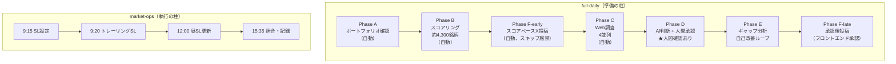

## この記事でわかること

- 投資歴5年・累計約100万円の損失から、「エンジニアリングで改善できるかもしれない」と考えて仕組みを作った経緯
- 毎日4,300銘柄以上をスコアリングするパイプライン（Phase A〜F）の全体アーキテクチャ
- 18エージェント・20スキルをClaude Codeで運用するための設計パターン（3層ペルソナ・ADR体系・自動化の境界線）
- 「感情的に失敗してきた人間」が「冷静なシステム」を作る過程で気づいた、設計自体の限界と自己改善ループ

---

## 導入: 感情で負け続けた5年間

「下がってる、でも反転するだろう。今売ると確定損が大きすぎる。」——そう思って画面から目を逸らしたことは、何度あっただろう。

投資歴5年。累計損失は約100万円。年平均で20万円を失い続けた計算になる。特定口座での信用取引（証券会社から資金を借りて行う売買）で約56万円、NISA口座の個別株で約40万円。NISAの損失は損益通算すら使えないので、痛みはもっと大きかった。

ゲームを作っていた会社の株を「好きだから」と買い、想定と全く違う動きに動揺して決断できないまま、気づいたら含み損が-23.9万円になっていた（ドリコム（3793））。ニチアス（5393）を特定口座で保有して-20.5万円。任天堂（7974）で+97,000円を取ったのに、「自分は相場が読める」という錯覚だけが残って次の失敗を呼んだ。

問題は下手さではなく（いや下手なんだけど）、判断基準がバラバラだったことではないか、と考えた。優待バリュー投資をやって「値動きが小さい」と売り、グロースに転向し、「なんとなくチャートが高そう」という印象で20銘柄を信用売りした。2022年の年間取引額は1,155万円に達したが、判断の根拠はニュースの雰囲気とチャートの印象だけだった。結果は年間最大損失の-25万円。

ある夜、また2〜3時間かけてチャートを確認していて気づいた。「取引できる銘柄って、こんなにたくさんあるんだ。」4,300銘柄のうち、自分が一回で見れるのはせいぜい30銘柄程度が限度、その中から選ぶ。残りの4,270銘柄は、自分にとって「存在しない」のと同じだった。

これはエンジニアリングで改善できるかもしれない、そう思った。

---

## きっかけ: 5年間負け続けた話

### 「-10%で損切り」が守れない理由

エントリー時には毎回「-10%になったら即切る」と決める。しかし実際に-10%になると「もう少し待てば戻るかも」と思い、-15%になると「今売ると確定損が大きすぎる」となり、-20%になると「もう見たくない」になる。

ドリコム（3793）はNISAで1,300株を約78万円で買った。当時ハマっていたゲームのリリース元だった。「好きな会社だから」という理由で入った。602円から418円への下落で損切りしたとき、損失は23.9万円だった。損切りルールを決めていたのに守れなかった原因は単純だ。判断の感情的コストが計算コストを上回っていた。

### 毎晩2〜3時間のスクリーニングという構造的な限界

- 株探で気になる銘柄を一つずつチャート確認する
- 30銘柄を見て力が尽きる
- 残り4,270銘柄は実質的に存在しない
- 「先週見た銘柄」に引きずられ、新しい候補を見逃す
- 翌朝のストップロス（SL: 損切り注文）発注を忘れる（寝坊した朝、子供の送りが長引いた朝）

スイングトレードを裁量でやるには、単純に時間が足りなかった。

### 成功が「再現不可能」だった

任天堂（7974）を8,320円で買い、9,290円で売って+97,000円を得た。フジ・メディア（4676）の信用売りで+13,447円を取った。しかし両方とも「なんとなく良さそう」で入っており、次回に同じ判断を再現できる根拠がなかった。

少しの成功体験が次の大きな失敗を呼ぶ構造になっていた。

### ターニングポイント: 「一貫した判断基準」がほしい

2022年の反省が一つの仮説を生んだ。判断基準がバラバラである限り、取引量を増やしても損失が拡大するだけではないか。「次はどう判断するか」ではなく「どんな状況でも同じ基準で動けるシステムを作る」ことが必要だった。

もう一つの仮説も形成された。「好決算なのに株価が下がるのはなぜ？」という疑問と、失敗経験の繰り返しから、「ファンダメンタルズが良くても株価が下がるなら、テクニカルが正しいのでは？」という考え方に辿り着いた（後にADR-001（Architecture Decision Record: 設計判断記録、後述）として記録することになる）。

これをClaude Codeで実装することにした。2025年12月、初期コミット。

---

## 解決策: AIエージェントによる仕組み化

ここからはシステムの設計を説明します。文体が変わりますが、作者の感情とAIエージェントによる仕組みを対比した意図的なコントラストです。ご了承ください。

また、この仕組みで投資が成功しているかというとそういうわけでもなく、現時点ではトントン、少しプラスという状態です。年初来安値を更新し続ける相場環境(2026/3/25現在)の中では悪くないかもしれませんが、べらぼうに良い数字が出ているわけではありません。これはあくまで実験です。ただ、「判断基準がバラバラで年20万円ずつ負ける」状態からは確実に変わりました。この相場で、過去の手作業の自分であれば、「ここから反転する」と根拠なく信じてホールドし続けていたはずです。AIエージェントと作ったストップロスで損切りする仕組みに従って、損切り済みの「トントン」ですので、納得しています。zennでの記事は、この仕組みをどう作ったか、という記録となります。

### 設計哲学の核心: 2つの戦略と、その違い

このシステムは**Long（現物買い）**と**Short（信用売り）**の2方向を扱います。当初、買いと売りは正対して動くものとして捉えましたが、現在両者は全く異なる哲学で動いています。

**Long（現物買い）の哲学**: 「セクター内で相対的に強い銘柄に、過熱する前に乗る」

スコアリングの支配的因子はセクター相対強度です。これはモメンタム戦略です。「まだ動いていない銘柄を検出する」という設計意図がありましたが、実装してみるとセクター比で既に強い銘柄を選ぶ結果になりました。設計意図と実装結果の乖離は、後にPhase 1（先行指標）への全面転換（ADR-002）として記録することになります。

**Short（信用売り）の哲学**: 「下落トレンドが確立した後、バウンス失敗の瞬間を待ち伏せる」

Shortは急落を追いません。下落中の銘柄ではなく、一度反発を試みてSMA25（25日移動平均線）で跳ね返されるのを待ちます。急落を「追いかける」のではなく「待ち構える」設計です。

この2つの哲学の違いが、スコアリングエンジンの設計に直結しています。

### 2つの柱: 準備と執行

システムは大きく2つの柱で構成されています。

**full-daily（準備の柱）**: 閉場後〜翌日開場前に実行し、翌日のアクションプランを生成します。Phase A〜Fの一気通貫パイプラインです。

**market-ops（執行の柱）**: 当日の市場時間中に動きます。発注・ストップロス設定・トレーリング更新・照合を時刻ベースのcron（Linuxの定時実行スケジューラ）で実行し、AIエージェントが実行状況を監視します。

---

## アーキテクチャ: Phase A〜F の全体フロー

### パイプライン概要図



### 各フェーズの詳細

**Phase A: ポートフォリオ確認（自動）**

kabu STATION APIを通じて現在の保有ポジション・資金余力・含み損益を取得します。異常があれば報告し、正常なら自動で続行します。ここは人間確認不要なフェーズです。

**Phase B: スコアリング（自動）**

このシステムの核心です。約4,315銘柄に対して2段階のスコアリングを実行します。

```python
# Phase 1: 4因子スコアリング（全銘柄対象）
# trend / momentum / volume / liquidity の4軸
# Phase 1 Top20が Phase 2 の入力になる

# Phase 2 Long: Safety x Upside（期待値モデル）
# Safetyを重視: 安全に入れるかを先に評価する

# Phase 2 Short: 4次元モデル
# Conviction × Timing × Regime × Guard
# bounce_failing状態がTimingの最高点
```

Phase 1で絞った候補をPhase 2で再評価する2段階構造です。Long候補は「安全に入れるか（Safety）」と「上値余地があるか（Upside）」を組み合わせて評価します（評価軸の組み合わせ方——なぜ単純な足し算ではないか——は別途ADR深掘り記事で解説予定です）。Short候補は4つの独立した次元で評価し、安全装置（Guard）が基準を下回る場合は強制除外します。

**Phase C: Web調査（4並列）**

Phase 2 Top候補に対して並列でWeb調査を実行します。スクリーナーCSVのテクニカル情報だけでは捉えられない、直近のニュース・決算情報・需給動向を補完します。

**Phase D: AI判断 + 人間承認（★唯一の人間確認ポイント）**

3層のペルソナ構造でポートフォリオ判断を行います。

```
新人（Haiku×6）
  → データ収集・基礎調査
アナリスト（Sonnet×9）
  → チャート解読・ニュース評価・レジーム判断
マネージャー（Opus×3）
  → ポートフォリオ全体判断・リスク管理・最終推奨
```

マネージャーの推奨を人間（私）が確認し、承認するとtrade_actions JSONが生成されます。このJSONが翌朝のmarket-opsへの引き渡しファイルになります。

**Phase E: ギャップ分析（自己改善ループ）**

「AIが推奨した内容」と「人間が実際に承認した内容」の差分を記録します。このギャップを蓄積することで、スコアリングパラメータの調整材料を得ます。OODA（Observe-Orient-Decide-Act）ループのOrient段階に相当します。

**Phase F: X投稿**

Phase BのスコアランキングをXに投稿するF-earlyと、Phase D承認後のコンテンツを投稿するF-lateに分かれます。F-earlyはデータの鮮度が命なので自動投稿、F-lateはフロントエンドで人間が目視確認してから投稿します。

### 自動化の境界線

システム設計で最も意識したのは「何を自動化して、何を人間が判断するか」の境界線です。

| 自動化する | 人間が判断する |
|-----------|--------------|
| 全4,300銘柄のスクリーニング | 銘柄選定の最終承認（Phase D） |
| Web調査（4並列） | 発注前のプラン確認 |
| SL管理（トレーリング自動更新） | 不整合の解決 |
| コンプライアンスチェック | 投稿の最終承認（F-late） |

**原則**: 情報収集・計算・ルーチン作業は自動化します。資金を動かす判断と外部への発信は人間が最終確認します。この境界線はADR-004として明文化されています。

---

## Claude Codeの活用: 18エージェント・20スキル体制

### 3層ペルソナ構造（ADR-003）

現在18エージェントが稼働しています（Opus×3 / Sonnet×9 / Haiku×6）。コスト管理と能力の最適配置を両立するための3層構造です。

```yaml
# エージェント役割分担（概要）
layer_1_haiku:  # データ収集・定型作業
  - shinjin-data-collector
  - shinjin-db-operator
  - shinjin-web-researcher
  - stock-research
  - x-post-writer
  - daily-ingest

layer_2_sonnet:  # 分析・評価・文章生成
  - analyst-chart-reader
  - analyst-news-assessor
  - analyst-regime
  - analyst-score-reviewer
  - content-editor
  - content-reviewer
  - note-article-writer
  - zenn-article-writer  # この記事を書いているエージェント
  - analyst-performance

layer_3_opus:  # ポートフォリオ全体の意思決定
  - manager-trade-decision
  - manager-improvement
  - manager-parameter-tuning
```

Haiku（Tier 1）は大量処理・定型作業を担います。Sonnet（Tier 2）は分析・評価・文章生成を担います。Opus（Tier 3）はポートフォリオ全体の意思決定のみに使います。全てをOpusで回すと費用が爆発します。

### スキルオーケストレーション（20スキル）

CLAUDE.mdにスキル起動テーブルを記述することで、自然言語での操作が可能になります。

```markdown
# CLAUDE.md（スキルディスパッチ早見表 抜粋）
| ユーザー発言 | 起動先 |
|-------------|--------|
| 「N/Nの処理」「日次処理」 | /full-daily スキル |
| 「銘柄チェック」「XXXXの状況」 | /quick-check スキル |
| 「買った」「エントリー記録」 | /bought スキル |
| 「Zenn記事」「技術記事」 | /zenn-article スキル |
```

「3/21の処理」と入力するだけで、フロントエンドの起動確認→Phase A実行→スコアリング→Web調査→承認フロー、という一連のパイプラインが起動します。

### メモリシステムとADR体系

Claude Codeには会話をまたいだ記憶がありません。この問題に対して、2つのアプローチを採用しています。

**MEMORYファイル**: 会話の中で発見した重要な事実（APIの仕様差異、日付セマンティクスの定義、注文フィールド名の違いなど）を蓄積します。次回の会話でエージェントがこのファイルを読み、文脈を復元します。

**ADR（Architecture Decision Record）体系**: ソフトウェアの設計判断を「背景・仮説・決定・結果」の構造で記録する手法です。もともとはマイクロサービスアーキテクチャの文脈で広まったもので、「なぜその設計にしたのか」を後から追跡できるようにするためのドキュメントです。

このプロジェクトでADRを導入したきっかけは、**人間もエージェントも、システムの詳細を把握できなくなった**ことでした。

ある日、スコアリングの精度を上げるためにv2エンジンを実装したのに、日次処理パイプラインではv1をずっと使い続けていたことに気づきました。エージェントも人間も「なぜv1なのか」を説明できない。そもそもv2を作った経緯も曖昧になっていた。

エージェントと対話しながら「どうすれば判断の根拠を残せるか？」を探った結果、ADRに辿り着きました。

```markdown
# ADRの構造（例: ADR-002）
## 状態: 採用
## 背景: Phase 0のスコアリングは遅行指標ベースで、
        「すでに上がっている銘柄」しか見つからなかった
## 仮説: 先行指標に切り替えれば「まだ動いていない銘柄」を検出できる
## 決定: Phase 1（先行指標型）に全面転換
## 結果: C Score（相対強度40%）が支配的で、
        実質的にはモメンタム戦略になった（設計意図との乖離）
```

現在26件のADRが蓄積されています。一般的なADRの用法とは異なりますが、このプロジェクトにおいてADRは3つの役割を果たしています。

1. **人間とエージェントをつなぐ**: 会話がリセットされても、エージェントがADRを読めば設計の経緯を復元できる
2. **迷ったときの道しるべ**: 「なぜこうなっているか」が明文化されているので、変更すべきかどうかの判断材料になる
3. **コンテンツのソースデータ**: ADRの構造がそのまま技術記事の骨格になる（この記事自体がその証拠です）

生成AIを活用した開発では、「判断の文脈が会話の中に消えていく」問題が必然的に発生します。ADRはその対策として有効だと感じています。

### market-ops: 執行の柱

full-dailyが「計画を作る柱」なら、market-opsは「その計画を実行し、守る柱」です。

```bash
# cron設定（概念）
# 9:15  SL初期設定（約定確認 + ストップロス発注）
# 9:20  トレーリングSL（1回目）
# 12:00 トレーリングSL（2回目）
# 15:35 照合（SL約定反映 + ポジション確認）
```

「SL発注忘れ」という手作業時代の最大の弱点が、cronによる完全自動化で解消されました。「寝坊した朝も無防備なポジションを持たない」という状態が実現しています。

---

## 運用結果と学び

### ADRがコンテンツの自動生成パイプラインになった

前述のADR体系が、意図せずnote記事やこのZenn記事のソースデータになりました。ADR-001「テクニカルはファンダメンタルズを包括する」には仮説に至った経緯が構造化されて記録されているので、「背景→判断→結果」の流れでそのまま記事になります。

実際、このプロジェクトのZenn記事パイプラインは `--type adr-deep-dive --adr 6` のようにADR番号を指定するだけで記事の骨格が自動生成される仕組みになっています。「コードを書きながら判断を記録する」ことと「記事のソースデータを蓄積する」ことが同じ行為になった、という副産物です。

### ブラックボックス問題: エージェントが多すぎて作者が理解できなくなった

18エージェントに成長した結果、「このエージェントが何をするのか」を自分が即答できない状態が生まれました。あるバグの原因がどのエージェントにあるか判断できないケースが発生しました。

これに対してADR-007「ブラックボックスの可視化と情報共有」で対処しています。用語集・ADRの充実・Mermaid図による可視化です。逆説的ですが、Zenn記事を書くことがシステムのデバッグ手法として機能することを発見しました。人間が読める言語で説明しようとすると、説明できない部分が設計の曖昧さに対応していることが多いためです。

### OODAループの明示化

手作業時代も無意識にOODAループを回していましたが、システム化することで構造が見えました。

```
Observe: Phase B（スコアリング） + Phase C（Web調査）
Orient:  Phase D（AI判断） + Phase E（ギャップ分析）
Decide:  人間承認（Phase D ゲート）
Act:     market-ops（発注・SL管理）
```

さらに2種類のループを区別しています（ADR-008）。**Single-loop**はパラメータの調整（閾値を少し変えるなど）。**Double-loop**は前提の見直し（そもそも先行指標型は正しいか、のような問い）。Phase 0からPhase 1への移行はDouble-loopの改善でした。

### 「感情を排除したかったのに、設計自体が感情的だった」

システムを3ヶ月運用して気づいたことがあります。

感情的な判断を排除するために始めたのに、スコアリングの設計には「下落中の銘柄を追いたくない」「踏み上げを怖れる」「急落に飛び乗るのは危険だ」という、感情から来た判断が大量に込められていました。

Shortの安全装置（踏み上げリスクの強制除外）は、過去に空売りで踏み上げられた経験から生まれています。トレーリングSLの段階的な設計は、含み損が大きすぎて動けなくなった恐怖から来ています。

「感情を排除したのではなく、感情をコードに翻訳したのかも？」と思うことが少なくありません。また、それが良いことか悪いことかはまだわかりません。ただ、「なんとなく」ではなく「ADRとして明文化された理由」で設計が存在することは確かです。

---

## まとめ

- 4,315銘柄のスコアリングを毎日自動実行する仕組みは、2025年12月〜2026年3月の約4ヶ月で段階的に構築しました
- 18エージェント・20スキルの体制は、コスト管理（Haiku/Sonnet/Opusの3層分業）と判断品質（人間承認ゲートの設計）を両立するための結果です
- ADR体系は「設計の理由を記録する」ための実践でしたが、気づいたらコンテンツのソースデータになっていました
- 「感情を排除する」ために作ったシステムは、感情をコードに翻訳したシステムでした——その認識がシステムの自己改善に繋がっています
- 投資成績は現時点でトントン〜微プラスです。「仕組みを作ったから勝てる」わけではなく、仕組みを回しながら改善し続ける実験の途中です

コードは公開していませんが、設計判断（ADR）の考え方やパイプライン構造については、今後もZennで詳細を書いていく予定です。

**関連ADR（参考）**

- ADR-001: テクニカルはファンダメンタルズを包括する
- ADR-002: Phase 0（遅行指標）からPhase 1（先行指標）への移行
- ADR-003: 3層ペルソナ構造（新人 / アナリスト / マネージャー）
- ADR-004: 人間承認の境界線
- ADR-006: Short 4Dモデル（Conviction × Timing × Regime × Guard）
- ADR-008: OODAループの体系化とKGI/KPI接続

---

※このzennの記事はシステム構築の実験記録です。スコアリングに使用している指標は独自に設計したものです。投資助言ではありません。スコアリングシステムの出力は銘柄の推奨や売買の指示ではなく、あくまで定量的なスクリーニング結果です。なお、zennではこのスクリーニング結果を直接扱いません。随時のスコア、週次や月次のサマリーなどは、x(旧twitter)、noteで公開しています。また、結果投資の判断は自己責任で行ってください。
