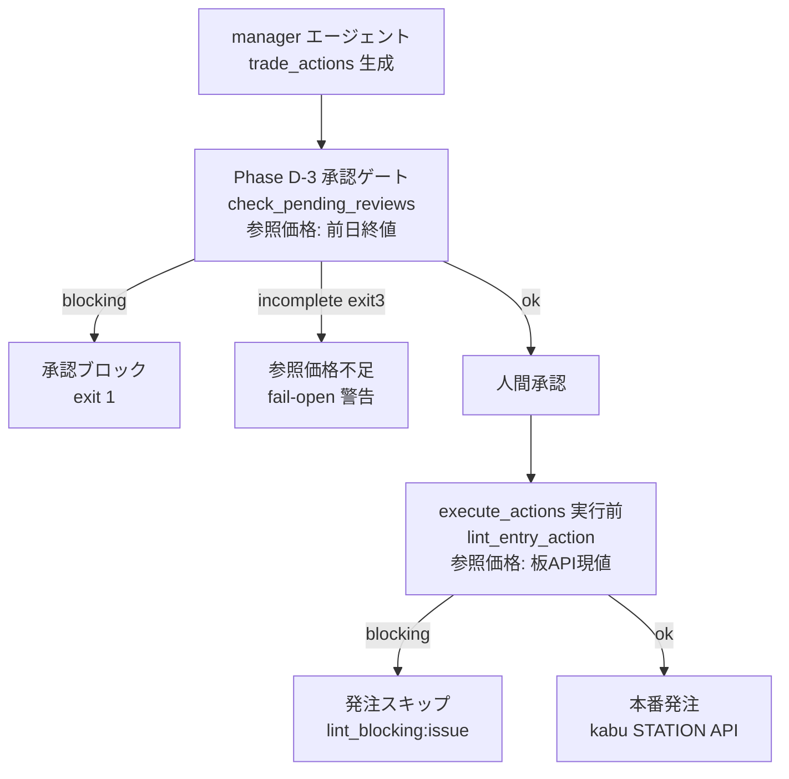

# 型では守れない不変条件を守る — 売買指値の方向リンター

「短期売り（Short）なのに、なぜ押し目買いの数式で指値が計算されているんだ」

2026年5月15日の朝、取引ログを見ていてそう気づきました。
クリエイトSDホールディングス（3148）のShortエントリーに `¥3,123`（≒ 現値 ¥3,220 × 0.97）という指値が記録されていました。この数式 `current × 0.97` は、押し目買い（Long）用の「現値より3%下に待つ」ロジックです。Shortは逆——「現値より上で待って、戻り売りを拾う」のが正しい。真逆の数式が使われていました。

> 関連ADR: `docs/decisions/028-trade-actions-envelope-type.md`（trade_actions envelope 型）
> 関連コミット: f52399b（manager 不変条件強制）, 0ed9223（linter 追加）, dd48b20（fail-open guard / exit 3）

## この記事でわかること

- Pydantic 型を入れても防げない「意味論的な不変条件」とは何か
- 売買指値の方向不変条件（Long: 指値 ≤ 現値 / Short: 指値 ≥ 現値）をリンターで守る設計
- fail-open ガード（参照価格が無いとき検証をスキップしたら exit 3）の考え方
- LLM（manager エージェント）の出力を本番執行前にゲートする多層防御

---

この記事はJPSS（日本株スイングシグナル）の実装記録シリーズの一本です。JPSSは約4,300銘柄を毎日2段階30指標以上でスコアリングし、AIエージェントが売買推奨を生成、人間が承認して発注する仕組みです。推奨の生成からAPIへの発注まで自動化しているぶん、「LLMが生成した数値を無検証で本番に流す」リスクを常に意識する必要があります。今回はその一例として、指値の方向バグとその対策を書きます。

---

## 背景：型では捕まえられなかった事故

### ADR-028 で導入した envelope 型

JPSSの日次パイプライン（Phase A-G）では、フルデイリー処理のPhase Dで manager エージェントが売買プランを `trade_actions/YYYY-MM-DD.json`（以下、trade_actions）に書き出し、翌朝の `execute_actions.py` がそれを読んで kabu STATION API（証券会社の発注API）に発注します。

2026年3月に ADR-028 を実装しました。それまで `trade_actions` のJSONに envelope 型（最上位のキー構造）の定義がなく、あるときは `entries` キーに、またあるときは `actions` キーにアクション配列が入るという状態でした。この構造揺れで「9107 川崎汽船のエントリーが0件として読み込まれ、発注されなかった」という障害が起きたのがきっかけです。

なお本記事で「Short（ショート）」と書くのは空売り——信用取引で株を借りて売り、値下がりで利益を狙う取引——を指します。「Long」は通常の現物買いです。

ADR-028 では Pydantic の `ActionPlanEnvelope` を定義し、`actions` キーを必須フィールドとしました。また `entries` → `actions` への正規化関数 `ensure_actions()` を追加し、どちらのキーで書かれていても動くフォールバックも整備しました。

```python
class ActionPlanEnvelope(BaseModel):
    data_date: str | None = None
    action_date: str | None = None
    regime: dict | None = None
    actions: list[dict]          # 必須フィールド
    entries: list[dict] | None = None
    portfolio_actions: list[dict] | None = None
    watchlist: list[dict] | None = None
    skipped: list[dict] | None = None
```

これで「actions キーが無い」問題は解決しました。しかし5月15日の事故は、型レベルでは完全に合法なデータで起きました。

### 事故の内部構造

問題のShortエントリーは、構造として何も間違っていません。以下は manager エージェントが生成した `trade_actions` の中身です（JPSS では生成された売買プランを人間が承認してから発注するため、この値がそのまま自動発注されるわけではありません）。

```json
{
  "type": "entry",
  "ticker": "3148",
  "direction": "short",
  "order_type": "limit",
  "price": 3123,
  "stop_loss": 3346,
  "reason": "確信度 low → 指値現値-3% (¥3,123) で抑制発注"
}
```

`price` は float として妥当。`direction` は `"short"` で正しい。`stop_loss` は `3346`（現値より上）で一見するとShortのSLとして正しそうに見えます。`ActionPlanEnvelope` のバリデーションは当然通ります。

しかし `price: 3123` は現値 `3220` の約97%、つまり「現値より下」です。これはLongの押し目買いロジック `price = current × 0.97` がShortに流用された結果でした。Shortの指値は「現値より上で待つ」——戻り高値に指値を置いてから売り建てるのが正しい。

Pydantic の型システムは「このフィールドは float か」「このキーは存在するか」を守ります。しかし「指値が参照価格との相対関係として正しい方向を向いているか」は判定できません。これは **値単体ではなく、参照価格との関係性** という意味論（セマンティクス）の問題だからです。

型が守るのは形。意味論は守れない。

---

## 設計判断：不変条件を「方向」として定義する

### 方向不変条件の定義

この問題を解決するために、まず不変条件を明文化しました。

| direction | 取引種別 | limit price の制約 | SL price の制約 |
|-----------|----------|-------------------|-----------------|
| long | 押し目買い | price ≤ current | sl < entry_price |
| short | 戻り売り | price ≥ current | sl > entry_price |

Longは「現値より下で待って、押したら買う」。currentより上に指値を置くと、現値で即約定できる注文を不利に変えるだけです。Shortは「現値より上で待って、戻ったら売り建てる」。逆に下に指値を置くと、現値で即約定できる売りを不利に変えるだけです。

この制約は、指値注文（limit order）においては数学的に決まります。例外はありません（成行注文には方向の概念がないため、リンターのチェック対象外です）。

manager エージェントの判断プロセス仕様（`.claude/agents/manager-trade-decision.md` Step 2.8）にこの不変条件を明記し、「マネージャー判断の段階で違反させないこと」と記述しました。しかし人間が書くプロンプトも、LLMが生成する出力も、必ずミスをする可能性があります。仕様書に書くだけでは不十分です。自動検出ゲートが必要でした。

### 3段階 severity の設計

リンターの問題報告を3段階に分けました。

| severity | 内容 | 処理 |
|----------|------|------|
| blocking | 方向違反、SL方向違反 | 承認ブロック・発注スキップ |
| warning | 過大オフセット（5%超）、reason文の符号不整合 | ログ出力のみ、ブロックしない |
| skipped | 参照価格なし（後述） | incomplete フラグを立てる |

blocking は「絶対に許してはいけない構造的な誤り」。warning は「おかしいかもしれないが人間が意図して設定した可能性がある」もの。たとえば現値から7%離れた指値は数学的に誤りではないので、ブロックではなく警告に留めます。

---

## 実装：manager への強制 + 専用リンター

### _check_limit_direction — 核心ロジック

```python
DIRECTION_EPSILON = 0.001
OVERSIZED_OFFSET_PCT = 0.05

def _check_limit_direction(direction: str, price: float, ref: float) -> list[dict]:
    """Check limit price against the direction invariant."""
    out: list[dict] = []
    epsilon = ref * DIRECTION_EPSILON
    offset_pct = (price - ref) / ref

    if direction == "long":
        if price > ref + epsilon:
            out.append({
                "severity": "blocking",
                "issue": "limit_direction_mismatch",
                "detail": (
                    f"Long limit ¥{price:,.0f} > current ¥{ref:,.0f} ({offset_pct:+.1%}). "
                    f"Long expects price ≤ current (押し目買い)."
                ),
            })
        elif offset_pct < -OVERSIZED_OFFSET_PCT:
            out.append({
                "severity": "warning",
                "issue": "oversized_offset",
                "detail": (
                    f"Long offset {offset_pct:.1%} below current ¥{ref:,.0f} "
                    f"exceeds {OVERSIZED_OFFSET_PCT:.0%} threshold (limit ¥{price:,.0f})."
                ),
            })
    elif direction == "short":
        if price < ref - epsilon:
            out.append({
                "severity": "blocking",
                "issue": "limit_direction_mismatch",
                "detail": (
                    f"Short limit ¥{price:,.0f} < current ¥{ref:,.0f} ({offset_pct:+.1%}). "
                    f"Short expects price ≥ current (戻り売り)."
                ),
            })
        elif offset_pct > OVERSIZED_OFFSET_PCT:
            out.append({
                "severity": "warning",
                "issue": "oversized_offset",
                # detail は Long 側と対称（+5%超で warning）
            })
    return out
```

`DIRECTION_EPSILON = 0.001`（0.1%）は、ティック丸めを許容するための余白です。参照価格が終値で、実際の指値は円単位に丸められるため、`price == current` と意図したものが数円の誤差を持つことがあります。0.1%の余裕でこれをカバーします。

### _check_sl_direction — SLの方向確認

```python
def _check_sl_direction(direction: str, base: float, sl: float) -> dict | None:
    """Verify SL is on the correct side of the entry/reference price."""
    if direction == "long" and sl >= base:
        return {
            "severity": "blocking",
            "issue": "sl_direction_mismatch",
            "detail": (
                f"Long SL ¥{sl:,.0f} must be < entry/ref ¥{base:,.0f} "
                f"(SL protects downside)."
            ),
        }
    if direction == "short" and sl <= base:
        return {
            "severity": "blocking",
            "issue": "sl_direction_mismatch",
            "detail": (
                f"Short SL ¥{sl:,.0f} must be > entry/ref ¥{base:,.0f} "
                f"(SL protects upside)."
            ),
        }
    return None
```

SL（ストップロス: 損切り注文）の基準値には、指値（limit price）が設定されていればそれを使い、なければ参照価格（ref_price）を使います。これにより、指値とSLの関係が正しいかを確認できます。

### _check_reason_direction — reason 文のサニティチェック

```python
REASON_OFFSET_PATTERN = re.compile(
    r"現値\s*([+\-－＋])\s*(\d+(?:\.\d+)?)\s*[%％]"
)

def _check_reason_direction(direction: str, reason: str) -> dict | None:
    """Find '現値±X%' in reason and verify the sign matches direction."""
    matches = REASON_OFFSET_PATTERN.findall(reason)
    if not matches:
        return None
    for sign, pct in matches:
        is_plus = sign in ("+", "＋")
        if direction == "long" and is_plus:
            return {
                "severity": "warning",
                "issue": "reason_text_direction_mismatch",
                "detail": (
                    f"Long reason contains '現値+{pct}%'; "
                    f"expected '現値-X%' for 押し目買い."
                ),
            }
        if direction == "short" and not is_plus:
            return {
                "severity": "warning",
                "issue": "reason_text_direction_mismatch",
                # detail は Long 側と対称（Short に「現値-X%」表記）
            }
    return None
```

このチェックは地味ですが重要なシグナルです。5月15日の事故では `reason` フィールドに「指値現値-3%」と書かれていました。Shortなのに「-3%」と書いてある——reason文が、LLMが押し目買いロジックを適用したことを正直に「告白」していたわけです。この warning が出ていれば、price の数値チェックの前段階で「何かがおかしい」と気づけます。

全角記号（`＋`/`－`）にも対応しているのは、LLMが全角記号を使う場合があるためです。

### 2層API設計

リンターは2つのAPIを提供します。

```python
# 1. 単発チェック（execute_actions 向け）
def lint_entry_action(action: dict, ref_price: float | None) -> list[dict]:
    ...

# 2. 一括チェック（Phase D-3 ゲート向け）
def lint_trade_actions(
    actions_doc: dict,
    reference_prices: dict[str, float]
) -> dict[str, Any]:
    """
    Returns:
        {
            "ok": bool,        # True iff no blocking issues
            "incomplete": bool,# True iff a limit entry's direction check
                               # was skipped for a missing reference price
            "blocking": [...],
            "warnings": [...],
            "skipped": [...],
        }
    """
```

参照価格（reference_prices）は呼び出し側が注入する設計（Dependency Injection）にしました。Phase D-3 ゲートは前日終値（DailyOHLCV テーブルの close）を渡し、execute_actions 本番発注時は kabu STATION API の board 現値を渡します。「どの価格を参照価格とするか」の判断はリンター外の責務です。リンター自体は pure function として実装し、テストが容易になっています。

---

## 多層防御：3つのゲートポイント



### Layer 1: manager エージェントの仕様強制

最初の防衛線は manager エージェント自身のプロンプト仕様です。`manager-trade-decision.md` の Step 2.8 に不変条件テーブルを明記し、違反の具体例（Short に `current × 0.97` を使う）を禁止例として示しました。LLMは仕様書の例示に従うため、ほとんどの場合はここで正しい出力が得られます。ただし「仕様を守る保証」はなく、これ単独では不十分です。

### Layer 2: Phase D-3 承認ゲート

`scripts/check_pending_reviews.py` に `collect_lint_events()` 関数を追加し、承認処理（Phase D-3）の実行前に trade_actions を自動リントします。

```python
# check_pending_reviews.py（追加部分の抜粋）
def collect_lint_events(action_date: date) -> list[dict]:
    plan = load_action_plan(action_date)
    if plan is None:
        return []
    plan = ensure_actions(plan)

    data_date_raw = plan.get("data_date")
    # ... date 解決 ...

    tickers = _collect_tickers(plan)
    with Session(get_engine()) as session:
        reference_prices = _load_reference_prices(session, data_date, tickers)

    result = lint_trade_actions(plan, reference_prices)
    # blocking と warning を VerificationEvent 形式に変換して返す
```

参照価格は `DailyOHLCV` テーブルの前日終値（close）です。翌朝の開場前に承認するため、最新の板（現在値）ではなく前日終値を使います。blocking が1件でもあると `check_pending_reviews` が exit 1 を返し、Phase D-3 の承認がブロックされます。

### Layer 3: execute_actions 本番発注前

`scripts/execute_actions.py` の `determine_skip()` 関数内に `lint_entry_action()` 呼び出しを追加しました。

```python
# execute_actions.py（追加部分の抜粋）
if api and api.is_authenticated:
    ref_price: float | None = None
    try:
        board = _api_call_with_retry(api.get_board, ticker)
        cp = board.get("CurrentPrice") if board else None
        if cp and cp > 0:
            ref_price = float(cp)
    except KabuApiError:
        ref_price = None

    if ref_price is not None:
        for issue in lint_entry_action(action, ref_price):
            if issue["severity"] == "blocking":
                logger.error(
                    "  Direction lint BLOCK [%s]: %s",
                    issue["issue"], issue["detail"],
                )
                return f"lint_blocking:{issue['issue']}"
```

ここでの参照価格は「板API（kabu board）の現在値」です。Phase D-3 の前日終値より鮮度が高く、開場後に価格が動いている場合も正確にチェックできます。dry-run モードではAPIコールを行わないためこのチェックはスキップし、代わりに Phase D-3 のゲートが保護します。

この3層構造の考え方は「LLM生成物は仕様違反の可能性があることを前提に、複数地点でゲートする」です。どれか1つを抜けても、次のゲートで止まります。

---

## fail-open ガード：「検証できない」を「問題なし」と混同しない

### 問題の発見

リンターを最初に実装したとき（0ed9223）、参照価格が存在しない限り定方向チェックをスキップし `skipped` に記録していました。そして `lint_trade_actions()` の `ok` フラグは `blocking == 0` のとき `True` を返します。

ここに穴がありました。2026-05-15 の trade_actions を `current_price=null`（参照価格なし）で渡すと、方向チェックがスキップされて結果が `ok=True` になります。「Short 3148 の指値方向違反を検証していない」のに「問題なし」と返してしまうのです。

これは fail-open（問題が検出できないとき通過させる）の典型例です。このリンターが存在する理由そのものを無効化するバグです。

### exit 3 による区別（dd48b20）

修正は `incomplete` フラグの追加と exit code 3 の導入です。

```python
def lint_trade_actions(actions_doc: dict, ...) -> dict[str, Any]:
    # ...
    return {
        "ok": len(blocking) == 0,
        "incomplete": any(
            s["issue"] == "no_reference_price" for s in skipped
        ),
        "blocking": blocking,
        "warnings": warnings,
        "skipped": skipped,
    }
```

```python
def main() -> int:
    # ...
    if not result["ok"]:
        return 1    # blocking violations detected
    if result.get("incomplete"):
        return 3    # incomplete verification
    return 0        # clean
```

exit code の意味論:

| code | 意味 |
|------|------|
| 0 | ok またはwarning のみ。方向チェック完了 |
| 1 | blocking 違反あり。発注前に修正が必要 |
| 2 | ファイルエラー・usage エラー |
| 3 | 検証不完全。limit entry があるが参照価格がなくチェックできなかった |

exit 3 は「問題は見つからなかったが、見つけられない状態にあった」を意味します。呼び出し側はこれを警告として人間に提示できます。パイプラインに組み込む際は `if exit_code not in (0,)` でブロック、または `exit_code == 3` の場合は人間確認を挟む設計が取れます。

```bash
$ PYTHONPATH=. .venv/bin/python scripts/lint_trade_actions.py \
    --trade-actions trade_actions/2026-05-15.json

FAIL: 1 blocking, 1 warnings, 0 skipped
  [BLOCK] 3148 (short): limit_direction_mismatch
          Short limit ¥3,123 < current ¥3,220 (-3.0%). Short expects price ≥ current (戻り売り).
  [WARN ] 3148 (short): reason_text_direction_mismatch
          Short reason contains '現値-3%'; expected '現値+X%' for 戻り売り.
```

---

## テスト：2026-05-15 を永遠に再現する

### 単体テストで回帰ケースを固定

```python
class TestShortDirection:
    def test_short_below_current_is_blocking(self):
        """2026-05-15 regression: Short 3148 at ¥3,123 < ¥3,220 must be blocked."""
        action = {
            "ticker": "3148",
            "direction": "short",
            "order_type": "limit",
            "price": 3123,
            "stop_loss": 3346,
            "reason": "確信度 low → 指値現値-3% (¥3,123) で抑制発注",
        }
        issues = lint_entry_action(action, ref_price=3220)
        blocking = _issues_of_severity(issues, "blocking")
        assert any(b["issue"] == "limit_direction_mismatch" for b in blocking)
```

このテストは「2026-05-15 に起きた具体的な数値」でリンターを呼び出し、blocking が返ることを確認します。リンターを将来改修したとき、このケースがサイレントに通過するようになればすぐに気づけます。

### historical replay テスト（1f08548）

さらに踏み込んで、`trade_actions/` ディレクトリに存在するすべての JSON ファイルを pytest のパラメトライズで自動的にリントするテストを追加しました。

```python
# tests/test_lint_trade_actions.py（抜粋）
_TRADE_ACTIONS_DIR = Path(__file__).resolve().parent.parent / "trade_actions"

# 2026-05-15 だけが blocking を返すべき
_HISTORICAL_REFS = {
    "2026-05-15": {"3148": 3220},
}

class TestHistoricalRegression:
    @pytest.mark.parametrize(
        "filename",
        sorted(_TRADE_ACTIONS_DIR.glob("*.json")),
        ids=lambda p: p.name,
    )
    def test_historical_plan_lints_clean_or_known_blocking(self, filename):
        doc = json.loads(filename.read_text(encoding="utf-8"))
        date_str = filename.stem  # "2026-05-15"
        refs = _HISTORICAL_REFS.get(date_str, {})
        result = lint_trade_actions(doc, reference_prices=refs)

        if date_str == "2026-05-15":
            assert not result["ok"], "2026-05-15 must block (Short 3148)"
            assert any(
                b["ticker"] == "3148" and b["issue"] == "limit_direction_mismatch"
                for b in result["blocking"]
            )
        else:
            assert result["ok"], f"{filename.name} should lint clean"
```

`_HISTORICAL_REFS` は「参照価格が判明している日付」だけを持つ辞書です。ここに登録のない日付は `refs={}` でリントされ、参照価格を必要としない `ok=True` のチェック（型・SL方向・reason文）だけが走ります。つまりこのテストは「過去ファイルが静かに壊れていないこと」を保証しますが、参照価格に依存する方向違反を過去全日付で検出するわけではありません。将来 blocking が期待される日付を増やすには、その日の参照価格を `_HISTORICAL_REFS` に手で追加する必要があります。回帰スナップショットは自動では育たない、という割り切りです。

新しい trade_actions ファイルがリポジトリに追加されるたびに、このテストが自動的にその日のファイルをリントします。新しい違反が混入していれば CI で検出できます。

---

## トレードオフと学び

### 型 vs リンターの役割分担

型システム（Pydantic）とリンターはどちらも「不正なデータを防ぐ」ためのツールですが、守る層が違います。

| ツール | 守るもの | 守れないもの |
|--------|---------|-------------|
| Pydantic 型 | フィールドの存在、型（float/str等）、必須キー | フィールド間の関係性、参照価格との相対的な意味 |
| 方向リンター | 参照価格との相対的な方向の正しさ | 価格が「経済的に妥当か」（それは人間の判断） |

両方が必要で、どちらかで代替できるわけではありません。

### LLM 出力の検証コスト

今回のバグはLLMが生成したJSONに含まれていました。LLMは「仕様書に書かれた例」には従いやすいですが、「数式が正しい方向を向いているか」という算術的な整合性を常に保証しません。確信度が低い場合に「より慎重な指値にしよう」と考えた結果、Long用の「控えめに指値を下げる」ロジックをShortに誤適用するようなことが起きます。

LLMの出力を本番に流すパイプラインでは、「LLMは正しい」という前提を置かず、数学的・構造的な不変条件をコードで検証するレイヤーが必要だと改めて認識しました。

### 参照価格の鮮度問題

Phase D-3 ゲートが使う「前日終値」と、execute_actions が使う「板の現在値」は異なります。翌朝の開場前に前日終値が ¥3,220 だったとして、開場後に ¥3,500 まで上昇していれば、前日終値基準では「問題なし」と判定されたShortの指値が現値より下になっているかもしれません。

これは解けない問題ではありませんが、現時点では「Phase D-3 では前日終値で大まかにチェック、execute_actions では板の現在値で厳密チェック」という多層対応で実用的な精度を確保しています。

### exit 3 を「無条件ブロック」にしなかった理由

検証不完全（exit 3）を即ブロックにせず警告に留めたのは、上位の呼び出し側に判断を委ねるためです。参照価格DBが未取り込みなど、運用上ありうる一時的な状態で発注全体が止まると、かえって運用が硬直します。「不完全な検証が行われた」という情報さえ失わずに渡しておけば、後から「exit 3 は無条件ブロック」にも「人間確認を挟む」にも変更できます。判断を奪わず、情報を渡す——これが今回の設計方針でした。

---

## まとめ

- Pydantic 型（ADR-028）は「形」を守る。指値の方向という「意味論」は守れない。これは型の限界ではなく、設計上の役割分担
- Long（押し目買い）は指値 ≤ 現値、Short（戻り売り）は指値 ≥ 現値、という不変条件をリンターで自動検出する
- 参照価格なしで方向チェックをスキップした場合は exit 3（incomplete）を返す。「違反は無い」と「検証していない」を混同しない fail-open ガード
- manager エージェント仕様強制 → Phase D-3 承認ゲート（前日終値）→ execute_actions 発注前（板の現在値）という多層防御で、LLM生成物を本番に流す前に複数地点でリント
- 2026-05-15 の具体的な数値を回帰テストに固定し、将来の改修で同じバグが再発しないようにする

なお、2026-05-15 の問題の指値（3148 Short ¥3,123）は実際には発注されていません。当日の執行ログ上 `execution_status=error`（未送信）のまま失効しており、ポジションは建たず、損失も出ていません。ただしこれは「リンターが止めたから」ではなく、たまたま別の理由で送信されなかっただけです。運に助けられた、というのが正直なところで、こうした事故を運任せにせず確実に止めるためにこのリンターを作りました。

このシステムはまだ実験段階で、Short精度の課題など解決していない問題が多くあります。「仕組みを作ったから大丈夫」ではなく、「こういう事故を起こしながら防衛層を積み上げている」という記録として読んでもらえれば。

---

※本記事は筆者の実験記録であり、投資助言ではありません。記事中のスコア・指標はすべて筆者が独自に算出した独自指標（非公式）であり、特定銘柄の売買を推奨するものではありません。投資判断はご自身の責任でお願いします。
