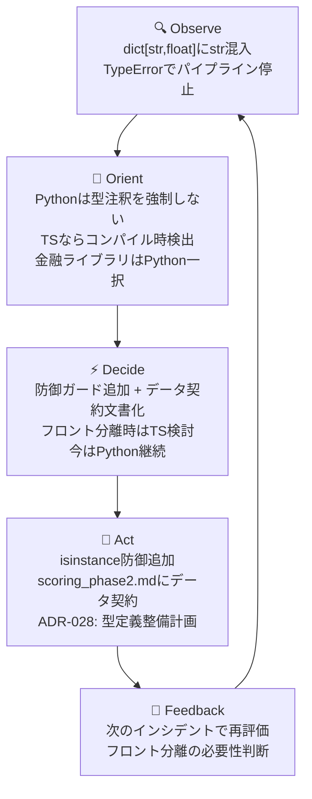

> **シリーズ: 日本株スイングトレードAI**
> 毎日約4,300銘柄をAIエージェントで自動スコアリングし、人間が最終判断するスイングトレードシステムの開発記録です。Claude Codeで18エージェント・20スキルを運用しています。前回の記事: [日本株4,300銘柄をAIエージェントで毎日分析する仕組みを作った](https://zenn.dev/taiki_kishi/articles/jpss-ai-agent-stock-analysis)

## この記事でわかること

- `TypeError` が個人プロジェクトで起きたとき「よかった」と思える理由と、組織プロジェクトで同じことが起きたときの危険性
- GitHub Octoverse 2025でTypeScriptが初めて1位になった背景と、型安全性がAIコーディング時代に持つ意味
- バイブコーディング（AI任せ比率の高いコーディング）の生産性トレードオフと、言語選択への影響
- Pythonを選び続ける合理的な理由と、OODAループで言語選択を継続的に見直すアプローチ

## 導入: TypeErrorで止まった朝

朝7時。スコアランキングの自動投稿が止まっていた。

```
TypeError: '<=' not supported between instances of 'str' and 'int'
```

`score_labels.py` がスコア詳細の辞書を走査し、`value <= 0` で比較しようとした瞬間に死んだ。原因はすぐわかった。上流の `_compute_regime_score` が `dict[str, float]` を返す契約のはずなのに、文字列の `regime_label` を混入させていた。

修正は10分。辞書構造を直し、文字列ラベルは別の場所に移した。

```python
# Before: dict[str, float] 型契約に違反
def _compute_regime_score(regime) -> tuple[float, dict[str, float]]:
    detail = {
        "regime_label": regime.label,        # str が混入
        "short_favorability": round(..., 4),
    }
    return score, detail

# After: 文字列ラベルは enriched_indicators（dict[str, Any]）へ移動
detail = {
    "short_favorability": round(..., 4),
    "regime_strength": round(..., 4),
}
enriched_indicators["regime_label"] = regime.label
```

修正後、「よかった」と思った。TypeErrorが出てくれたから。

気づかなければそのまま動き続けていた。`score_labels.py` がたまたま `<=` 比較をしていたから止まった。もしその処理がJSONシリアライズだったら？文字列が混入した辞書はそのままファイルに書き出され、下流のスクリプトが間違ったデータで動き続ける。誰も気づかないまま、何週間も。

今回は[X自動投稿](https://x.com/quant_swing_jp)のスコアランキング生成が止まっただけだ。個人プロジェクトの自動SNS投稿だから「今日の投稿がない」で終わる。被害はゼロ。

だが組織プロジェクトや製品で同じことが起きたら？スコアリングシステムが間違った数値を配信し続け、それをもとにした意思決定が積み重なる。サイレントに間違ったデータが流れ続けるほうが、派手にクラッシュするより致命的なことがある。

このインシデントで「型」のことを改めて考えた。Python、TypeScript、バイブコーディング、OODAループ——そのあたりの話をまとめておく。

---

## TypeScriptが首位になった

2025年のGitHub Octoverseレポートで、TypeScriptがコントリビューター数で初めて1位を獲得しました。前年比+66%、260万人超のコントリビューター。レポートはこれを「20年以上で最大の言語シフト」と表現しています。

出典: [GitHub Octoverse 2025 - A new developer joins GitHub every second as AI leads TypeScript to #1](https://github.blog/news-insights/octoverse/octoverse-a-new-developer-joins-github-every-second-as-ai-leads-typescript-to-1/)

なぜTypeScriptなのか。レポートが指摘する要因のひとつは「AIコーディングツールとの相性」です。

Pythonは動的型付けです。変数の型を宣言しなくても動く。これは手早く書ける半面、AIが生成したコードの品質保証が難しい面があります。人間が書くコードでも型の意図は暗黙知になりがちですが、AIが書くコードはその傾向がより強くなる可能性があります。

TypeScriptなら、今回の問題はコンパイル時に止まっていました。

```typescript
type ScoreDetail = Record<string, number>;

const detail: ScoreDetail = {
  regime_label: regime.label,  // Error: Type 'string' is not assignable to type 'number'
  short_favorability: 0.85,
};
```

`Record<string, number>` という宣言があれば、文字列を代入しようとした瞬間にエディタが赤線を引きます。実行前に、コードを書いた段階で、検出できます。

型は「コンパイラへの命令」ではなく「コードの契約書」です。「この関数は数値の辞書を返す」という約束を機械可読な形で書いておけば、AIが生成したコードも、人間が書いたコードも、その約束を破ったときに即座にわかる。

AI生成コードの比率が上がるほど、この「契約書」の価値は高まります。

## バイブコーディングと型安全性のジレンマ

「バイブコーディング」という言葉をご存じでしょうか。AIに大まかな意図を伝え、生成されたコードをほぼそのまま使うスタイルのコーディングです。細部を自分で書かず、AIに任せる比率を上げる。

このスタイルで言語の生産性を比較したベンチマークがあります。

[Which programming language is best for Claude Code?](https://dev.to/mame/which-programming-language-is-best-for-claude-code-508a) によると、Claude Codeでの実装速度はPythonが最速（73-75秒）、TypeScriptは約1.6倍の時間がかかるという結果でした。

この数字だけ見ると「Pythonのほうが速い」で話が終わりそうです。しかし生成速度と保守安全性はトレードオフです。

バイブコーディングの比率が上がるほど、生成されたコードの中に型の不整合が忍び込む余地も増えます。人間が一行一行書いていれば気づく「あ、ここにstrが入るはずがない」という感覚を、AI生成コードのレビューで維持し続けるのは難しい。

TypeScriptの型チェックは、そのギャップを埋める仕組みとして機能します。生成速度を多少犠牲にしても、コンパイル時に型エラーを検出できる環境を整えることで、AIが書いたコードの「隠れた契約違反」を自動的に発見できる。

「AI時代に型が重要になる」という直感は、ここから来ています。

## なぜこのrepoはPythonなのか

正直に言えば、このシステムをPythonで書いたのは「Pythonしか選択肢がなかった」からです。

株式のテクニカル分析には `pandas`、`numpy`、`ta-lib` が必要です。日本株固有のデータ処理（J-Quantsのレスポンス形式、kabu STATION APIとのやりとり）も、Pythonのエコシステムが圧倒的に充実しています。金融テクニカル指標の計算ライブラリをTypeScriptで再現しようとすると、相当な工数が必要になります。

Claude Codeに「日本株のスコアリングシステムを作りたい」と相談したとき、最初の提案もPythonでした。スコアリング、ポートフォリオ管理、X API経由の自動投稿まで、すべてPythonで完結できる。スコアランキング・市場分析・銘柄選定結果の報告を毎日自動化するパイプラインを、一つの言語で回せることは、個人プロジェクトでは大きなメリットです。

型注釈の不在は既知のリスクです。mypy等の静的型検査をCIに組み込んでいないため、型契約は人間の注意力に依存しています。個人プロジェクトで一人で書いている間は「それでもなんとかなる」状態が続きますが、コードベースが大きくなるほど、今回のようなインシデントが増える可能性があります。

では型をどう守るか。Pythonでもできる防御策はあります。

```python
# 防御ガード: 非数値をスキップ
for key, value in safety_detail.items():
    if not isinstance(value, (int, float)) or value <= 0:
        continue
    # 数値であることが保証された状態で処理

# より堅牢: Pydanticで実行時型チェック
from pydantic import BaseModel, StrictFloat

class ScoreDetail(BaseModel):
    short_favorability: StrictFloat
    regime_strength: StrictFloat
    # regime_label を入れようとすると ValidationError が発生

# 使用例
try:
    detail = ScoreDetail(
        short_favorability=0.85,
        regime_strength=0.72,
    )
except ValidationError as e:
    logger.error(f"ScoreDetail 型違反: {e}")
    raise
```

`isinstance` チェックは軽量な防御線です。Pydanticはより強力で、モデル定義がそのまま型ドキュメントになります。今回のインシデントを受けて、スコアリングの主要な出力型にPydanticを段階的に適用することを検討しています。

## 本当にTS不要か

「今はPython継続が合理的」と書いた直後ですが、将来の選択肢を考えると話は変わります。

現在このシステムにはフロントエンドがあります。Next.jsで書かれた承認UIで、日次のトレード候補を人間が確認・承認するための画面です。このフロントエンドのコードは現在TypeScriptで書かれています。

バックエンド（Python FastAPI）とフロントエンド（TypeScript Next.js）が共存する構成で、APIのスキーマ定義はバックエンド側にしか存在しません。フロントエンドはバックエンドのレスポンス構造を「信頼して」使っています。

OpenAPI仕様を自動生成してTypeScript側の型を自動導出する構成にすれば、バックエンドとフロントエンドの型契約を共有できます。スコア詳細の辞書が変わったとき、フロントエンドのコンパイルが通らなくなります。変更の伝播が型システムによって自動検出されます。

Claude Codeに実際に聞いてみました。投げた質問はこうです。

> 「このプロジェクトの言語スタックはPython一択です。TypeScriptが人気みたいだけど、部分移行する価値がある条件を教えてください」

返ってきた回答の要点はこうです。

- Pythonを維持する理由: 金融ライブラリのエコシステム、既存コードベースの規模、単一言語での完結性
- TypeScriptを検討する条件: フロントエンドとの型共有が必要になったとき、チームでの開発が始まったとき、APIの契約違反によるバグが増えてきたとき

AIペアプロは言語選択の相談相手にもなります。「なぜその言語を選ぶのか」「どんな条件が揃ったら切り替えを検討するか」を言語化する補助として、Claude Codeは実用的でした。技術的な根拠を整理しながら、判断の基準を明確にできます。

## OODAで回す

このシステムの日次運用はADR-008でOODAループとして体系化しています。

```
Observe:  Phase B（スコアリング）+ Phase C（Web調査）
Orient:   analyst-regime + analyst-score-reviewer の分析
Decide:   Phase D（manager-trade-decision + 人間承認）
Act:      market-ops（執行 + SL管理）
Feedback: Phase E（ギャップ分析）→ tune-score / 新ADR
```

今回のインシデントも、同じフレームワークで整理できます。



Actのフェーズで実際に記録したのがADR-028（パイプライン共通型定義とドメイン境界の整備）です。`dict[str, float]` という暗黙の型契約を明示的なPydanticモデルに置き換え、ドメインごとに型モジュールを整理する計画を立てました。

```python
# ADR-028 Phase 1: ActionPlanEnvelope の例
from pydantic import BaseModel
from typing import Literal

class ActionPlanEnvelope(BaseModel):
    data_date: str | None = None
    action_date: str | None = None
    regime: dict | None = None
    actions: list[dict]   # 必須。executorはここを参照する
    # plans由来（参考情報として許容、実行には使わない）
    entries: list[dict] | None = None
    portfolio_actions: list[dict] | None = None
```

「Pythonで型安全を保つ」のはTypeScriptより手間がかかります。型注釈を書いても実行時には無視されます。Pydanticを使えば実行時検証が加わりますが、コンパイル時検出ではありません。それでも「型を書く文化」を維持することは、コードの読みやすさとバグの発見しやすさに直接影響します。

OODAループを言語選択に適用するとはそういうことです。一度決めたらそのままではなく、インシデントのたびに観察し、状況が変わったら判断を更新します。TypeScriptへの移行条件が整ったと判断したときに、そのときに動けばいいのです。

## まとめ

今回のインシデントから整理できたポイントを5つ並べます。

**1. TypeScriptが1位になったのは偶然ではない**

型はAI生成コード時代の唯一の契約書です。生成速度と保守安全性のトレードオフを考えたとき、バイブコーディングの比率が上がるほど型システムの価値は増します。

**2. Pythonを選ぶ場面はある**

金融テクニカル分析のエコシステムに代替はありません。言語の人気度よりも、やりたいことに必要なライブラリが揃っているかどうかのほうが、個人プロジェクトでは現実的な判断基準です。

**3. 言語選択は一度きりの決断ではない**

OODAループで回す対象に、言語選択も含めていいと思います。今の判断は「今の条件のもとでの最善」であって、条件が変わったら再評価する余地を残しておくことが重要です。

**4. Claude Codeは言語選択の相談相手にもなる**

「なぜその言語なのか」「いつ切り替えるか」を言語化するプロセスで、AIペアプロは実用的です。技術的な根拠を整理しながら、判断の基準を明確にできます。

**5. 型がなくても防御はできる。コスト対効果は規模次第**

`isinstance` チェックとPydanticは、TypeScriptの型システムほど強力ではありませんが、個人プロジェクトのスケールでは十分に機能します。型システムへの投資コストは、チームの規模とコードベースの複雑さに応じて判断するべきです。

---

このシステムの開発状況は [X @quant_swing_jp](https://x.com/quant_swing_jp) で日々更新しています。技術的な詳細は [Zenn](https://zenn.dev/taiki_kishi) に、トレードの背景は [note](https://note.com/quant_swing_jp) に書いています。

---

※本記事は筆者の実験記録であり、投資助言ではありません。投資判断はご自身の責任でお願いします。記事中のスコアリングシステムは独自指標であり、将来の株価を予測するものではありません。
